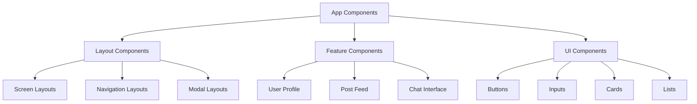

# Component Design

Guide to building reusable, maintainable, and scalable React Native components using modern design patterns.

## Component Architecture Patterns

### Component Hierarchy



### Component Types

| Type                   | Purpose                   | Examples                | Reusability |
| ---------------------- | ------------------------- | ----------------------- | ----------- |
| **UI Components**      | Basic building blocks     | Button, Input, Card     | High        |
| **Layout Components**  | Structure and positioning | Container, Grid, Stack  | High        |
| **Feature Components** | Business logic            | UserProfile, PostCard   | Medium      |
| **Page Components**    | Full screens              | HomeScreen, LoginScreen | Low         |

## Design Patterns

### 1. Compound Components

```typescript
// components/Card/Card.tsx
interface CardProps {
  children: React.ReactNode;
  className?: string;
}

function Card({ children, className }: CardProps) {
  return (
    <View className={cn('bg-white rounded-lg shadow-sm border', className)}>
      {children}
    </View>
  );
}

function CardHeader({ children, className }: CardProps) {
  return (
    <View className={cn('px-6 py-4 border-b border-gray-200', className)}>
      {children}
    </View>
  );
}

function CardContent({ children, className }: CardProps) {
  return (
    <View className={cn('px-6 py-4', className)}>
      {children}
    </View>
  );
}

function CardFooter({ children, className }: CardProps) {
  return (
    <View className={cn('px-6 py-4 border-t border-gray-200', className)}>
      {children}
    </View>
  );
}

// Compound component
Card.Header = CardHeader;
Card.Content = CardContent;
Card.Footer = CardFooter;

export { Card };

// Usage
<Card>
  <Card.Header>
    <Text className="text-lg font-semibold">User Profile</Text>
  </Card.Header>
  <Card.Content>
    <Text>User information goes here</Text>
  </Card.Content>
  <Card.Footer>
    <Button>Edit Profile</Button>
  </Card.Footer>
</Card>
```

### 2. Render Props Pattern

```typescript
// components/DataFetcher.tsx
interface DataFetcherProps<T> {
  url: string;
  children: (data: {
    data: T | null;
    loading: boolean;
    error: Error | null;
    refetch: () => void;
  }) => React.ReactNode;
}

function DataFetcher<T>({ url, children }: DataFetcherProps<T>) {
  const [data, setData] = useState<T | null>(null);
  const [loading, setLoading] = useState(false);
  const [error, setError] = useState<Error | null>(null);

  const fetchData = useCallback(async () => {
    setLoading(true);
    setError(null);
    try {
      const response = await fetch(url);
      const result = await response.json();
      setData(result);
    } catch (err) {
      setError(err as Error);
    } finally {
      setLoading(false);
    }
  }, [url]);

  useEffect(() => {
    fetchData();
  }, [fetchData]);

  return <>{children({ data, loading, error, refetch: fetchData })}</>;
}

// Usage
<DataFetcher<User> url="/api/user/123">
  {({ data: user, loading, error, refetch }) => {
    if (loading) return <LoadingSpinner />;
    if (error) return <ErrorMessage error={error} onRetry={refetch} />;
    if (!user) return <NotFound />;

    return <UserProfile user={user} />;
  }}
</DataFetcher>
```

### 3. Higher-Order Components (HOCs)

```typescript
// hocs/withAuth.tsx
function withAuth<P extends object>(
  WrappedComponent: React.ComponentType<P>
) {
  return function AuthenticatedComponent(props: P) {
    const { user, isLoading } = useAuth();

    if (isLoading) {
      return <LoadingScreen />;
    }

    if (!user) {
      return <Redirect href="/auth/login" />;
    }

    return <WrappedComponent {...props} />;
  };
}

// Usage
const ProtectedProfile = withAuth(ProfileScreen);
```

### 4. Custom Hooks Pattern

```typescript
// hooks/useToggle.ts
export function useToggle(initialValue = false) {
  const [value, setValue] = useState(initialValue);

  const toggle = useCallback(() => setValue(v => !v), []);
  const setTrue = useCallback(() => setValue(true), []);
  const setFalse = useCallback(() => setValue(false), []);

  return { value, toggle, setTrue, setFalse };
}

// hooks/useForm.ts
export function useForm<T extends Record<string, any>>(initialValues: T, validationSchema?: any) {
  const [values, setValues] = useState<T>(initialValues);
  const [errors, setErrors] = useState<Partial<Record<keyof T, string>>>({});
  const [touched, setTouched] = useState<Partial<Record<keyof T, boolean>>>({});

  const setValue = useCallback((field: keyof T, value: any) => {
    setValues(prev => ({ ...prev, [field]: value }));
  }, []);

  const setFieldTouched = useCallback((field: keyof T) => {
    setTouched(prev => ({ ...prev, [field]: true }));
  }, []);

  const validate = useCallback(() => {
    if (!validationSchema) return true;

    try {
      validationSchema.validateSync(values, { abortEarly: false });
      setErrors({});
      return true;
    } catch (err: any) {
      const validationErrors: Partial<Record<keyof T, string>> = {};
      err.inner.forEach((error: any) => {
        validationErrors[error.path as keyof T] = error.message;
      });
      setErrors(validationErrors);
      return false;
    }
  }, [values, validationSchema]);

  const reset = useCallback(() => {
    setValues(initialValues);
    setErrors({});
    setTouched({});
  }, [initialValues]);

  return {
    values,
    errors,
    touched,
    setValue,
    setFieldTouched,
    validate,
    reset,
    isValid: Object.keys(errors).length === 0,
  };
}
```

## Component Composition

### Container/Presenter Pattern

```typescript
// containers/UserProfileContainer.tsx
export function UserProfileContainer({ userId }: { userId: string }) {
  const { data: user, isLoading, error } = useUser(userId);
  const updateUser = useUpdateUser();
  const { showToast } = useToast();

  const handleUpdateUser = async (updates: Partial<User>) => {
    try {
      await updateUser.mutateAsync({ ...user, ...updates });
      showToast('Profile updated successfully', 'success');
    } catch (error) {
      showToast('Failed to update profile', 'error');
    }
  };

  if (isLoading) return <LoadingSpinner />;
  if (error) return <ErrorMessage error={error} />;
  if (!user) return <NotFound />;

  return (
    <UserProfilePresenter
      user={user}
      onUpdateUser={handleUpdateUser}
      isUpdating={updateUser.isPending}
      />
    );
  }

// components/UserProfilePresenter.tsx
  interface UserProfilePresenterProps {
    user: User;
    onUpdateUser: (updates: Partial<User>) => void;
    isUpdating: boolean;
  }

  export function UserProfilePresenter({
    user,
    onUpdateUser,
    isUpdating
  }: UserProfilePresenterProps) {
    const [isEditing, setIsEditing] = useState(false);

    return (
      <ScrollView className="flex-1 bg-gray-50">
        <View className="bg-white p-6">
          <Avatar source={{ uri: user.avatar }} size="large" />

          {isEditing ? (
            <EditUserForm
              user={user}
              onSave={(updates) => {
                onUpdateUser(updates);
                setIsEditing(false);
              }}
              onCancel={() => setIsEditing(false)}
              isLoading={isUpdating}
              />
            ) : (
              <UserInfo
                user={user}
                onEdit={() => setIsEditing(true)}
                />
              )}
            </View>
          </ScrollView>
        );
      }
```

### Polymorphic Components

```typescript
// components/Button/Button.tsx
interface ButtonOwnProps {
  variant?: 'primary' | 'secondary' | 'outline';
  size?: 'sm' | 'md' | 'lg';
  loading?: boolean;
  children: React.ReactNode;
}

type ButtonProps<T extends React.ElementType = 'button'> = {
  as?: T;
} & ButtonOwnProps &
Omit<React.ComponentPropsWithoutRef<T>, keyof ButtonOwnProps>;

export function Button<T extends React.ElementType = 'button'>({
  as,
  variant = 'primary',
  size = 'md',
  loading = false,
  children,
  className,
  disabled,
  ...props
}: ButtonProps<T>) {
  const Component = as || Pressable;

  return (
    <Component
      className={cn(
        'rounded-lg items-center justify-center',
        {
          'bg-blue-500': variant === 'primary',
          'bg-gray-200': variant === 'secondary',
          'border border-gray-300': variant === 'outline',
          'px-3 py-2': size === 'sm',
          'px-4 py-3': size === 'md',
          'px-6 py-4': size === 'lg',
          'opacity-50': disabled || loading,
        },
        className
      )}
      disabled={disabled || loading}
      {...props}
      >
      {loading ? (
        <ActivityIndicator size="small" color="white" />
      ) : (
        <Text className={cn(
            'font-medium',
            {
              'text-white': variant === 'primary',
              'text-gray-800': variant === 'secondary',
              'text-gray-600': variant === 'outline',
              'text-sm': size === 'sm',
              'text-base': size === 'md',
              'text-lg': size === 'lg',
            }
          )}>
          {children}
        </Text>
      )}
    </Component>
  );
}

// Usage
<Button>Default Button</Button>
<Button as={Link} href="/profile">Link Button</Button>
<Button as={TouchableOpacity} onPress={handlePress}>Touch Button</Button>
```

## Component Testing

### Unit Testing

```typescript
// __tests__/Button.test.tsx
import { render, fireEvent } from '@testing-library/react-native';
import { Button } from '../Button';

describe('Button', () => {
  it('renders correctly', () => {
    const { getByText } = render(<Button>Click me</Button>);
    expect(getByText('Click me')).toBeTruthy();
  });

  it('calls onPress when pressed', () => {
    const onPress = jest.fn();
    const { getByText } = render(
      <Button onPress={onPress}>Click me</Button>
    );

    fireEvent.press(getByText('Click me'));
    expect(onPress).toHaveBeenCalledTimes(1);
  });

  it('shows loading state', () => {
    const { getByTestId } = render(
      <Button loading>Loading</Button>
    );

    expect(getByTestId('activity-indicator')).toBeTruthy();
  });

  it('applies correct variant styles', () => {
    const { getByText } = render(
      <Button variant="secondary">Secondary</Button>
    );

    const button = getByText('Secondary').parent;
    expect(button).toHaveStyle({ backgroundColor: '#e5e7eb' });
  });
});
```

### Component Stories (Storybook)

```typescript
// stories/Button.stories.tsx
import type { Meta, StoryObj } from '@storybook/react';
import { Button } from '../components/Button';

const meta: Meta<typeof Button> = {
  title: 'UI/Button',
  component: Button,
  parameters: {
    layout: 'centered',
  },
  argTypes: {
    variant: {
      control: { type: 'select' },
      options: ['primary', 'secondary', 'outline'],
    },
    size: {
      control: { type: 'select' },
      options: ['sm', 'md', 'lg'],
    },
  },
};

export default meta;
type Story = StoryObj<typeof meta>;

export const Primary: Story = {
  args: {
    children: 'Primary Button',
    variant: 'primary',
  },
};

export const Secondary: Story = {
  args: {
    children: 'Secondary Button',
    variant: 'secondary',
  },
};

export const Loading: Story = {
  args: {
    children: 'Loading Button',
    loading: true,
  },
};
```

## Performance Optimization

### Memoization

```typescript
// Memoize expensive components
const ExpensiveComponent = React.memo(({ data, onUpdate }) => {
  const processedData = useMemo(() => {
    return data.map(item => ({
      ...item,
      processed: expensiveCalculation(item),
    }));
  }, [data]);

  const handleUpdate = useCallback((id: string, updates: any) => {
    onUpdate(id, updates);
  }, [onUpdate]);

  return (
    <View>
      {processedData.map(item => (
        <ItemComponent
          key={item.id}
          item={item}
          onUpdate={handleUpdate}
          />
        ))}
      </View>
    );
  });

// Custom comparison function
  const ItemComponent = React.memo(({ item, onUpdate }) => {
    return (
      <View>
        <Text>{item.name}</Text>
        <Button onPress={() => onUpdate(item.id, { viewed: true })}>
          Mark as Viewed
        </Button>
      </View>
    );
  }, (prevProps, nextProps) => {
// Custom comparison logic
    return (
      prevProps.item.id === nextProps.item.id &&
      prevProps.item.name === nextProps.item.name &&
      prevProps.item.viewed === nextProps.item.viewed
    );
  });
```

## Best Practices

### 1. Component Structure

```typescript
// Good component structure
import React, { useState, useCallback, useMemo } from 'react';
import { View, Text, Pressable } from 'react-native';
import { cn } from '@/lib/utils';

// 1. Types and interfaces
interface UserCardProps {
  user: User;
  onPress?: (user: User) => void;
  variant?: 'default' | 'compact';
}

// 2. Component definition
export function UserCard({
  user,
  onPress,
  variant = 'default'
}: UserCardProps) {
// 3. State and hooks
  const [isPressed, setIsPressed] = useState(false);

// 4. Computed values
  const displayName = useMemo(() => {
    return user.firstName && user.lastName
    ? `${user.firstName} ${user.lastName}`
    : user.email;
  }, [user.firstName, user.lastName, user.email]);

// 5. Event handlers
  const handlePress = useCallback(() => {
    onPress?.(user);
  }, [onPress, user]);

// 6. Render
  return (
    <Pressable
      onPress={handlePress}
      onPressIn={() => setIsPressed(true)}
      onPressOut={() => setIsPressed(false)}
      className={cn(
        'p-4 bg-white rounded-lg border',
        {
          'bg-gray-50': isPressed,
          'p-2': variant === 'compact',
        }
      )}
      >
      <View className="flex-row items-center">
        <Avatar source={{ uri: user.avatar }} />
        <View className="ml-3 flex-1">
          <Text className="font-semibold">{displayName}</Text>
          <Text className="text-gray-600">{user.email}</Text>
        </View>
      </View>
    </Pressable>
  );
}
```

### 2. Error Boundaries

```typescript
// components/ErrorBoundary.tsx
interface ErrorBoundaryState {
  hasError: boolean;
  error?: Error;
}

export class ErrorBoundary extends React.Component<
React.PropsWithChildren<{}>,
ErrorBoundaryState
> {
  constructor(props: React.PropsWithChildren<{}>) {
    super(props);
    this.state = { hasError: false };
  }

  static getDerivedStateFromError(error: Error): ErrorBoundaryState {
    return { hasError: true, error };
  }

  componentDidCatch(error: Error, errorInfo: React.ErrorInfo) {
    console.error('Error caught by boundary:', error, errorInfo);
    // Log to crash reporting service
  }

  render() {
    if (this.state.hasError) {
      return (
        <View className="flex-1 items-center justify-center p-4">
          <Text className="text-lg font-semibold mb-2">
            Something went wrong
          </Text>
          <Text className="text-gray-600 text-center mb-4">
            We're sorry for the inconvenience. Please try again.
          </Text>
          <Button onPress={() => this.setState({ hasError: false })}>
            Try Again
          </Button>
        </View>
      );
    }

    return this.props.children;
  }
}
```

## Next Steps

1. Choose appropriate design patterns for your components
2. Implement a consistent component structure across your app
3. Set up component testing with Jest and React Native Testing Library
4. Create a component library with Storybook
5. Optimize performance with proper memoization

---

**Pro Tip**: Start with simple components and gradually add complexity. Focus on reusability and maintainability over premature optimization.
