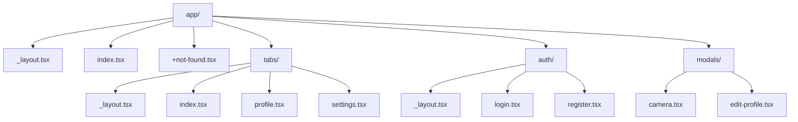
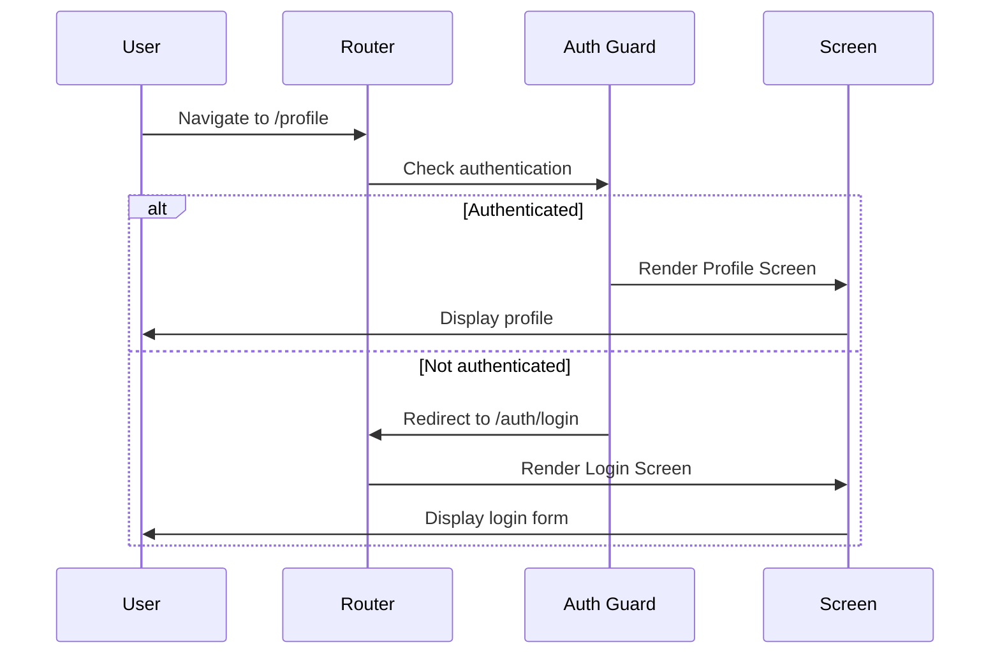
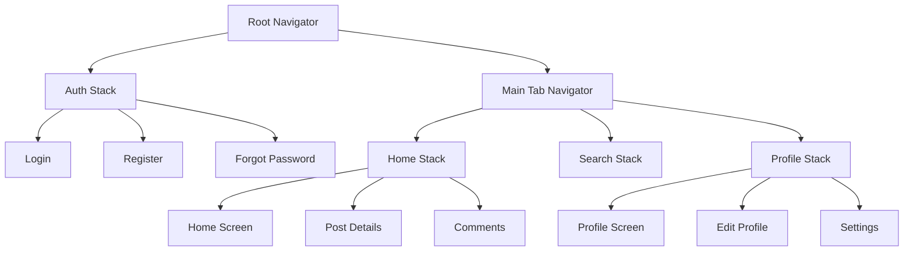

# Navigation

Comprehensive guide to implementing navigation in React Native applications using Expo Router and React Navigation.

## Navigation Strategies

### Expo Router vs React Navigation

| Feature            | Expo Router                   | React Navigation |
| ------------------ | ----------------------------- | ---------------- |
| **Paradigm**       | File-based routing            | Component-based  |
| **Learning Curve** | Easier (familiar to web devs) | Steeper          |
| **Type Safety**    | Automatic route typing        | Manual typing    |
| **Deep Linking**   | Built-in                      | Manual setup     |
| **Web Support**    | Excellent                     | Good             |
| **Flexibility**    | Less flexible                 | More flexible    |

## Expo Router (Recommended)

### File-based Routing Structure



### Basic Setup

```typescript
// app/_layout.tsx - Root Layout
import { Stack } from 'expo-router';
import { StatusBar } from 'expo-status-bar';
import { QueryClient, QueryClientProvider } from '@tanstack/react-query';
import { AuthProvider } from '@/lib/auth/AuthProvider';

const queryClient = new QueryClient();

export default function RootLayout() {
  return (
    <QueryClientProvider client={queryClient}>
      <AuthProvider>
        <Stack screenOptions={{ headerShown: false }}>
          <Stack.Screen name="(tabs)" />
          <Stack.Screen name="(auth)" />
          <Stack.Screen
            name="(modals)"
            options={{ presentation: 'modal' }}
            />
          </Stack>
          <StatusBar style="auto" />
        </AuthProvider>
      </QueryClientProvider>
    );
  }
```

### Tab Navigation

```typescript
// app/(tabs)/_layout.tsx
import { Tabs } from 'expo-router';
import { Ionicons } from '@expo/vector-icons';

export default function TabLayout() {
  return (
    <Tabs
      screenOptions={{
        tabBarActiveTintColor: '#007AFF',
        tabBarInactiveTintColor: '#8E8E93',
        headerShown: false,
      }}
      >
      <Tabs.Screen
        name="index"
        options={{
          title: 'Home',
          tabBarIcon: ({ color, size }) => (
            <Ionicons name="home" size={size} color={color} />
          ),
        }}
        />
        <Tabs.Screen
          name="search"
          options={{
            title: 'Search',
            tabBarIcon: ({ color, size }) => (
              <Ionicons name="search" size={size} color={color} />
            ),
          }}
          />
          <Tabs.Screen
            name="profile"
            options={{
              title: 'Profile',
              tabBarIcon: ({ color, size }) => (
                <Ionicons name="person" size={size} color={color} />
              ),
            }}
            />
          </Tabs>
        );
      }
```

### Navigation Flow



### Protected Routes

```typescript
// components/AuthGuard.tsx
import { useAuth } from '@/hooks/useAuth';
import { Redirect } from 'expo-router';

interface AuthGuardProps {
  children: React.ReactNode;
  fallback?: string;
}

export function AuthGuard({ children, fallback = '/auth/login' }: AuthGuardProps) {
  const { isAuthenticated, isLoading } = useAuth();

  if (isLoading) {
    return <LoadingScreen />;
  }

  if (!isAuthenticated) {
    return <Redirect href={fallback} />;
  }

  return <>{children}</>;
}

// app/(tabs)/_layout.tsx
export default function TabLayout() {
  return (
    <AuthGuard>
      <Tabs>
        {/* Tab screens */}
      </Tabs>
    </AuthGuard>
  );
}
```

### Dynamic Routes

```typescript
// app/user/[id].tsx
import { useLocalSearchParams } from 'expo-router';

export default function UserProfile() {
  const { id } = useLocalSearchParams<{ id: string }>();

  return (
    <View>
      <Text>User ID: {id}</Text>
    </View>
  );
}

// Navigation
import { router } from 'expo-router';

// Navigate to user profile
router.push(`/user/${userId}`);

// With query parameters
router.push({
  pathname: '/user/[id]',
  params: { id: userId, tab: 'posts' }
});
```

### Modal Navigation

```typescript
// app/(modals)/camera.tsx
import { router } from 'expo-router';

export default function CameraModal() {
  const handleClose = () => {
    router.back();
  };

  const handleCapture = (photo: Photo) => {
    // Handle photo capture
    router.back();
  };

  return (
    <View style={{ flex: 1 }}>
      <CameraView onCapture={handleCapture} />
      <Button title="Close" onPress={handleClose} />
    </View>
  );
}

// Open modal
router.push('/camera');
```

## React Navigation

### Stack Navigation

```typescript
import { createNativeStackNavigator } from '@react-navigation/native-stack';

type RootStackParamList = {
  Home: undefined;
  Profile: { userId: string };
  Settings: undefined;
};

const Stack = createNativeStackNavigator<RootStackParamList>();

function RootStack() {
  return (
    <Stack.Navigator>
      <Stack.Screen name="Home" component={HomeScreen} />
      <Stack.Screen name="Profile" component={ProfileScreen} />
      <Stack.Screen name="Settings" component={SettingsScreen} />
    </Stack.Navigator>
  );
}
```

### Tab Navigation

```typescript
import { createBottomTabNavigator } from '@react-navigation/bottom-tabs';

type TabParamList = {
  Home: undefined;
  Search: undefined;
  Profile: undefined;
};

const Tab = createBottomTabNavigator<TabParamList>();

function TabNavigator() {
  return (
    <Tab.Navigator>
      <Tab.Screen name="Home" component={HomeScreen} />
      <Tab.Screen name="Search" component={SearchScreen} />
      <Tab.Screen name="Profile" component={ProfileScreen} />
    </Tab.Navigator>
  );
}
```

## Navigation Patterns

### Nested Navigation



### Deep Linking

```typescript
// app.json
{
  "expo": {
    "scheme": "myapp",
    "web": {
      "bundler": "metro"
    }
  }
}

// Handle deep links
import { useEffect } from 'react';
import { Linking } from 'react-native';
import { router } from 'expo-router';

export function useDeepLinking() {
  useEffect(() => {
    const handleDeepLink = (url: string) => {
      // Parse URL and navigate
      const route = parseDeepLink(url);
      if (route) {
        router.push(route);
      }
    };

    // Handle initial URL
    Linking.getInitialURL().then((url) => {
      if (url) handleDeepLink(url);
    });

    // Handle subsequent URLs
    const subscription = Linking.addEventListener('url', ({ url }) => {
      handleDeepLink(url);
    });

    return () => subscription?.remove();
  }, []);
}

function parseDeepLink(url: string): string | null {
// myapp://user/123 -> /user/123
  const match = url.match(/myapp:\/\/(.+)/);
  return match ? `/${match[1]}` : null;
}
```

### Navigation State Management

```typescript
// hooks/useNavigationState.ts
import { useNavigation, useRoute } from '@react-navigation/native';

export function useNavigationState() {
  const navigation = useNavigation();
  const route = useRoute();

  const goBack = () => {
    if (navigation.canGoBack()) {
      navigation.goBack();
    }
  };

  const resetToHome = () => {
    navigation.reset({
      index: 0,
      routes: [{ name: 'Home' }],
    });
  };

  return {
    navigation,
    route,
    goBack,
    resetToHome,
    canGoBack: navigation.canGoBack(),
  };
}
```

## Advanced Navigation Patterns

### Conditional Navigation

```typescript
// app/_layout.tsx
import { useAuth } from '@/hooks/useAuth';

export default function RootLayout() {
  const { isAuthenticated, isLoading } = useAuth();

  if (isLoading) {
    return <LoadingScreen />;
  }

  return (
    <Stack screenOptions={{ headerShown: false }}>
      {isAuthenticated ? (
        <Stack.Screen name="(tabs)" />
      ) : (
        <Stack.Screen name="(auth)" />
      )}
    </Stack>
  );
}
```

### Navigation Middleware

```typescript
// lib/navigation/middleware.ts
export function createNavigationMiddleware() {
  return {
    beforeNavigate: (route: string, params?: any) => {
      // Log navigation events
      analytics.track('navigation', { route, params });

      // Check permissions
      if (route.startsWith('/admin') && !user.isAdmin) {
        throw new Error('Unauthorized');
      }

      return true;
    },

    afterNavigate: (route: string) => {
      // Update breadcrumbs
      updateBreadcrumbs(route);
    },
  };
}
```

## Best Practices

### 1. Type Safety

```typescript
// types/navigation.ts
export type RootStackParamList = {
  Home: undefined;
  Profile: { userId: string };
  Post: { postId: string; commentId?: string };
};

declare global {
  namespace ReactNavigation {
    interface RootParamList extends RootStackParamList {}
  }
}

// Usage with type safety
import { router } from 'expo-router';

router.push({
  pathname: '/profile/[userId]',
  params: { userId: '123' }, // TypeScript will validate this
});
```

### 2. Navigation Testing

```typescript
// __tests__/navigation.test.tsx
import { render, fireEvent } from '@testing-library/react-native';
import { NavigationContainer } from '@react-navigation/native';

function renderWithNavigation(component: React.ReactElement) {
  return render(
    <NavigationContainer>
      {component}
    </NavigationContainer>
  );
}

test('navigates to profile when button is pressed', () => {
  const { getByText } = renderWithNavigation(<HomeScreen />);

  fireEvent.press(getByText('Go to Profile'));

// Assert navigation occurred
});
```

### 3. Performance Optimization

```typescript
// Lazy load screens
const ProfileScreen = lazy(() => import('./ProfileScreen'));
const SettingsScreen = lazy(() => import('./SettingsScreen'));

// Preload critical screens
import('./ProfileScreen');
```

## Next Steps

1. Choose between Expo Router and React Navigation based on your needs
2. Set up your navigation structure with proper typing
3. Implement authentication guards for protected routes
4. Add deep linking support for better user experience
5. Test your navigation flows thoroughly

---

**Pro Tip**: Start with Expo Router if you're building a new app. It provides better developer experience and automatic type safety. Use React Navigation if you need more complex navigation patterns or are migrating an existing app.
