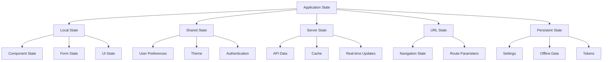
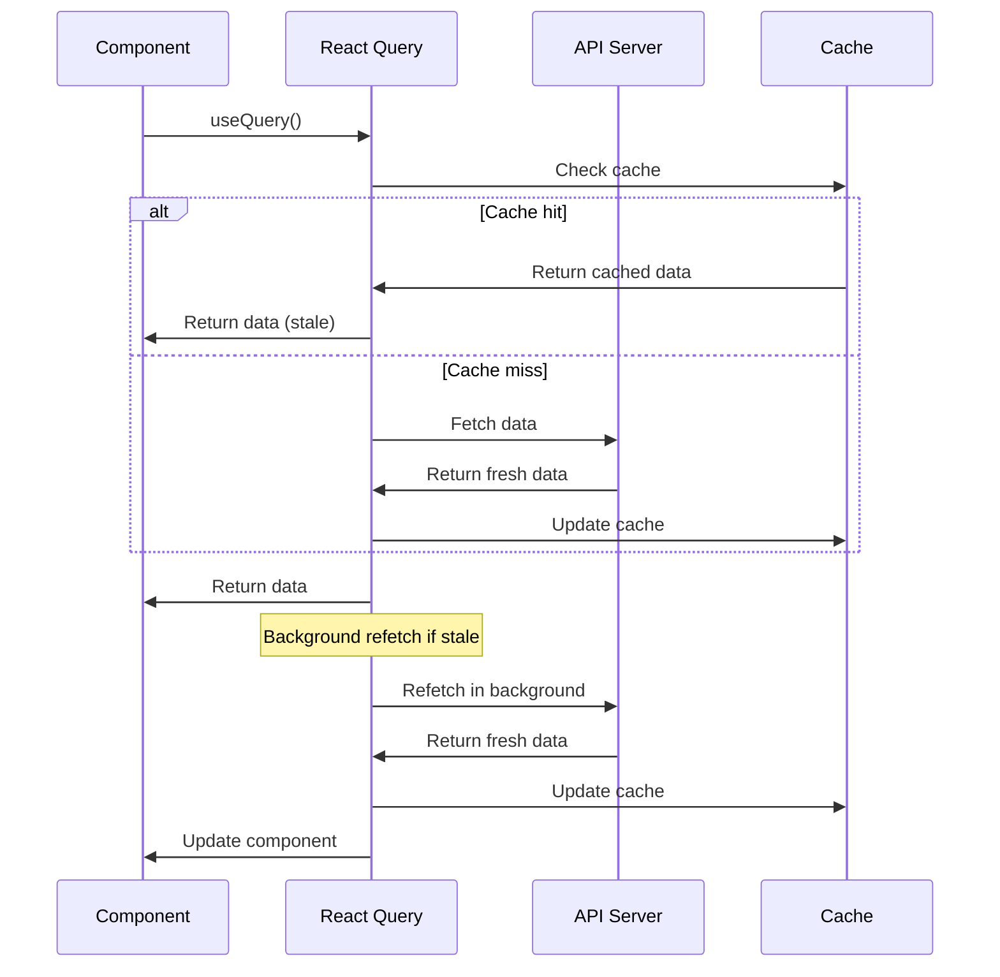

# State Management

Comprehensive guide to managing state in React Native applications using modern patterns and libraries.

## State Management Strategy

### Types of State



### Choosing the Right Solution

| State Type       | Recommended Solution     | Use Case                             |
| ---------------- | ------------------------ | ------------------------------------ |
| Component State  | `useState`, `useReducer` | Form inputs, toggles, local UI state |
| Shared State     | `Zustand`, `Context`     | User preferences, theme, auth state  |
| Server State     | `React Query`, `SWR`     | API data, caching, synchronization   |
| Persistent State | `MMKV`, `AsyncStorage`   | Settings, offline data, tokens       |

## Zustand (Recommended)

### Why Zustand?

- Minimal boilerplate
- TypeScript-first
- No providers needed
- Great DevTools
- Excellent performance

### Basic Setup

```bash
npm install zustand
```

### Simple Store

```typescript
// store/useCounterStore.ts
import { create } from 'zustand';

interface CounterState {
  count: number;
  increment: () => void;
  decrement: () => void;
  reset: () => void;
}

export const useCounterStore = create<CounterState>((set) => ({
  count: 0,
  increment: () => set((state) => ({ count: state.count + 1 })),
  decrement: () => set((state) => ({ count: state.count - 1 })),
  reset: () => set({ count: 0 }),
}));

// Usage in component
function Counter() {
  const { count, increment, decrement, reset } = useCounterStore();

  return (
    <View>
      <Text>Count: {count}</Text>
      <Button onPress={increment} title="+" />
      <Button onPress={decrement} title="-" />
      <Button onPress={reset} title="Reset" />
    </View>
  );
}
```

### Advanced Zustand Patterns

#### Slices Pattern

```typescript
// store/slices/authSlice.ts
export interface AuthSlice {
  user: User | null;
  token: string | null;
  isAuthenticated: boolean;
  login: (user: User, token: string) => void;
  logout: () => void;
}

export const createAuthSlice: StateCreator<AuthSlice & UserSlice, [], [], AuthSlice> = (
  set,
  get
) => ({
  user: null,
  token: null,
  isAuthenticated: false,
  login: (user, token) => {
    set({ user, token, isAuthenticated: true });
    // Access other slices
    get().setUserPreferences(user.preferences);
  },
  logout: () => set({ user: null, token: null, isAuthenticated: false }),
});

// store/index.ts
export const useAppStore = create<AuthSlice & UserSlice>()((...a) => ({
  ...createAuthSlice(...a),
  ...createUserSlice(...a),
}));
```

#### Persistence

```typescript
import { persist, createJSONStorage } from 'zustand/middleware';
import { MMKV } from 'react-native-mmkv';

const storage = new MMKV();

const mmkvStorage = {
  setItem: (name: string, value: string) => {
    return storage.set(name, value);
  },
  getItem: (name: string) => {
    const value = storage.getString(name);
    return value ?? null;
  },
  removeItem: (name: string) => {
    return storage.delete(name);
  },
};

export const useAuthStore = create<AuthState>()(
  persist(
    (set, get) => ({
      user: null,
      token: null,
      login: (user, token) => set({ user, token }),
      logout: () => set({ user: null, token: null }),
    }),
    {
      name: 'auth-storage',
      storage: createJSONStorage(() => mmkvStorage),
      partialize: state => ({
        user: state.user,
        token: state.token,
      }),
    }
  )
);
```

## React Query for Server State

### Setup

```bash
npm install @tanstack/react-query
```

```typescript
// app/_layout.tsx
import { QueryClient, QueryClientProvider } from '@tanstack/react-query';

const queryClient = new QueryClient({
  defaultOptions: {
    queries: {
      staleTime: 1000 * 60 * 5, // 5 minutes
      retry: 3,
    },
  },
});

export default function RootLayout() {
  return (
    <QueryClientProvider client={queryClient}>
      {/* Your app */}
    </QueryClientProvider>
  );
}
```

### Query Hooks

```typescript
// hooks/useUsers.ts
export function useUsers(filters?: UserFilters) {
  return useQuery({
    queryKey: ['users', filters],
    queryFn: () => userService.getUsers(filters),
    enabled: !!filters,
  });
}

export function useUser(userId: string) {
  return useQuery({
    queryKey: ['user', userId],
    queryFn: () => userService.getUser(userId),
    enabled: !!userId,
  });
}

// Infinite queries for pagination
export function useInfiniteUsers() {
  return useInfiniteQuery({
    queryKey: ['users', 'infinite'],
    queryFn: ({ pageParam = 1 }) => userService.getUsers({ page: pageParam }),
    getNextPageParam: (lastPage, pages) => {
      return lastPage.hasMore ? pages.length + 1 : undefined;
    },
  });
}
```

### State Flow Diagram



## Best Practices

### 1. State Colocation

```typescript
// Bad - Global state for local concerns
const useGlobalFormStore = create(set => ({
  formData: {},
  setFormData: data => set({ formData: data }),
}));

// Good - Local state for local concerns
function ContactForm() {
  const [formData, setFormData] = useState({});
  // Form logic here
}
```

### 2. Derived State

```typescript
// Bad - Storing derived state
const useUserStore = create(set => ({
  user: null,
  isAdmin: false,
  setUser: user => set({ user, isAdmin: user.role === 'admin' }),
}));

// Good - Computing derived state
const useUserStore = create(set => ({
  user: null,
  setUser: user => set({ user }),
}));

const useIsAdmin = () => useUserStore(state => state.user?.role === 'admin');
```

### 3. Action Creators

```typescript
// Good - Centralized actions
const useUserStore = create((set, get) => ({
  users: [],
  loading: false,

  // Action creators
  actions: {
    async fetchUsers() {
      set({ loading: true });
      try {
        const users = await userService.getUsers();
        set({ users, loading: false });
      } catch (error) {
        set({ loading: false });
        throw error;
      }
    },

    addUser(user: User) {
      set(state => ({ users: [...state.users, user] }));
    },

    removeUser(userId: string) {
      set(state => ({
        users: state.users.filter(u => u.id !== userId),
      }));
    },
  },
}));

// Usage
const { users, loading } = useUserStore();
const { fetchUsers, addUser } = useUserStore(state => state.actions);
```

## Performance Optimization

### Selectors

```typescript
// Use specific selectors to prevent unnecessary re-renders
export const useUser = () => useAuthStore(state => state.user);
export const useIsAuthenticated = () => useAuthStore(state => state.isAuthenticated);

// Shallow comparison for objects
import { shallow } from 'zustand/shallow';

export const useUserProfile = () =>
  useAuthStore(
    state => ({
      name: state.user?.name,
      email: state.user?.email,
      avatar: state.user?.avatar,
    }),
    shallow
  );
```

### React Query Optimization

```typescript
// Prefetch data
const queryClient = useQueryClient();

// Prefetch user data
await queryClient.prefetchQuery({
  queryKey: ['user', userId],
  queryFn: () => userService.getUser(userId),
});

// Optimistic updates
const updateUser = useMutation({
  mutationFn: userService.updateUser,
  onMutate: async updatedUser => {
    await queryClient.cancelQueries({ queryKey: ['user', updatedUser.id] });
    const previousUser = queryClient.getQueryData(['user', updatedUser.id]);
    queryClient.setQueryData(['user', updatedUser.id], updatedUser);
    return { previousUser };
  },
  onError: (err, updatedUser, context) => {
    queryClient.setQueryData(['user', updatedUser.id], context?.previousUser);
  },
});
```

## Next Steps

1. Choose your state management strategy based on app complexity
2. Set up Zustand for client state management
3. Implement React Query for server state
4. Add persistence for important data
5. Create custom hooks for complex state logic

---

**Pro Tip**: Start with local state and React Query. Add Zustand only when you need to share state between distant components. Avoid over-engineering your state management early on.
