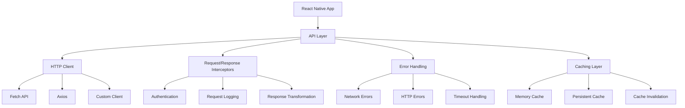

# API Integration

Comprehensive guide to integrating APIs in React Native applications with modern patterns, error handling, and performance optimization.

## API Architecture Overview



## HTTP Client Setup

### Custom API Client

```typescript
// lib/api/client.ts
interface ApiClientConfig {
  baseURL: string;
  timeout?: number;
  headers?: Record<string, string>;
}

interface RequestConfig {
  method?: 'GET' | 'POST' | 'PUT' | 'DELETE' | 'PATCH';
  headers?: Record<string, string>;
  body?: any;
  timeout?: number;
  cache?: boolean;
}

interface ApiResponse<T> {
  data: T;
  status: number;
  headers: Headers;
  ok: boolean;
}

class ApiClient {
  private baseURL: string;
  private defaultHeaders: Record<string, string>;
  private timeout: number;
  private interceptors: {
    request: Array<(config: RequestConfig) => RequestConfig | Promise<RequestConfig>>;
    response: Array<(response: ApiResponse<any>) => ApiResponse<any> | Promise<ApiResponse<any>>>;
  };

  constructor(config: ApiClientConfig) {
    this.baseURL = config.baseURL;
    this.timeout = config.timeout || 10000;
    this.defaultHeaders = {
      'Content-Type': 'application/json',
      ...config.headers,
    };
    this.interceptors = {
      request: [],
      response: [],
    };
  }

  addRequestInterceptor(
    interceptor: (config: RequestConfig) => RequestConfig | Promise<RequestConfig>
  ) {
    this.interceptors.request.push(interceptor);
  }

  addResponseInterceptor(
    interceptor: (response: ApiResponse<any>) => ApiResponse<any> | Promise<ApiResponse<any>>
  ) {
    this.interceptors.response.push(interceptor);
  }

  async request<T>(endpoint: string, config: RequestConfig = {}): Promise<ApiResponse<T>> {
    const url = `${this.baseURL}${endpoint}`;

    // Apply request interceptors
    let requestConfig = { ...config };
    for (const interceptor of this.interceptors.request) {
      requestConfig = await interceptor(requestConfig);
    }

    const headers = {
      ...this.defaultHeaders,
      ...requestConfig.headers,
    };

    const controller = new AbortController();
    const timeoutId = setTimeout(() => controller.abort(), requestConfig.timeout || this.timeout);

    try {
      const response = await fetch(url, {
        method: requestConfig.method || 'GET',
        headers,
        body: requestConfig.body ? JSON.stringify(requestConfig.body) : undefined,
        signal: controller.signal,
      });

      clearTimeout(timeoutId);

      let data: T;
      const contentType = response.headers.get('content-type');

      if (contentType && contentType.includes('application/json')) {
        data = await response.json();
      } else {
        data = (await response.text()) as unknown as T;
      }

      let apiResponse: ApiResponse<T> = {
        data,
        status: response.status,
        headers: response.headers,
        ok: response.ok,
      };

      // Apply response interceptors
      for (const interceptor of this.interceptors.response) {
        apiResponse = await interceptor(apiResponse);
      }

      if (!response.ok) {
        throw new ApiError(response.status, data as any, response.statusText);
      }

      return apiResponse;
    } catch (error) {
      clearTimeout(timeoutId);

      if (error.name === 'AbortError') {
        throw new ApiError(408, 'Request timeout', 'Request Timeout');
      }

      throw error;
    }
  }

  async get<T>(
    endpoint: string,
    config?: Omit<RequestConfig, 'method' | 'body'>
  ): Promise<ApiResponse<T>> {
    return this.request<T>(endpoint, { ...config, method: 'GET' });
  }

  async post<T>(
    endpoint: string,
    body?: any,
    config?: Omit<RequestConfig, 'method'>
  ): Promise<ApiResponse<T>> {
    return this.request<T>(endpoint, { ...config, method: 'POST', body });
  }

  async put<T>(
    endpoint: string,
    body?: any,
    config?: Omit<RequestConfig, 'method'>
  ): Promise<ApiResponse<T>> {
    return this.request<T>(endpoint, { ...config, method: 'PUT', body });
  }

  async delete<T>(
    endpoint: string,
    config?: Omit<RequestConfig, 'method' | 'body'>
  ): Promise<ApiResponse<T>> {
    return this.request<T>(endpoint, { ...config, method: 'DELETE' });
  }
}

class ApiError extends Error {
  constructor(
    public status: number,
    public data: any,
    public statusText: string
  ) {
    super(`API Error ${status}: ${statusText}`);
    this.name = 'ApiError';
  }
}

export { ApiClient, ApiError };
```

### API Client Configuration

```typescript
// lib/api/index.ts
import { ApiClient } from './client';
import { authStorage } from '../auth/storage';

const apiClient = new ApiClient({
  baseURL: process.env.EXPO_PUBLIC_API_URL || 'https://api.example.com',
  timeout: 15000,
});

// Authentication interceptor
apiClient.addRequestInterceptor(async config => {
  const token = await authStorage.getToken();
  if (token) {
    config.headers = {
      ...config.headers,
      Authorization: `Bearer ${token}`,
    };
  }
  return config;
});

// Response interceptor for token refresh
apiClient.addResponseInterceptor(async response => {
  if (response.status === 401) {
    // Handle token refresh
    try {
      const refreshToken = await authStorage.getRefreshToken();
      if (refreshToken) {
        const newTokens = await refreshAuthTokens(refreshToken);
        await authStorage.setTokens(newTokens.accessToken, newTokens.refreshToken);

        // Retry original request
        // Note: This is a simplified example
        // In practice, you'd want to retry the original request
      }
    } catch (error) {
      // Redirect to login
      await authStorage.clearTokens();
      // Navigate to login screen
    }
  }
  return response;
});

// Logging interceptor (development only)
if (__DEV__) {
  apiClient.addRequestInterceptor(config => {
    console.log('API Request:', config);
    return config;
  });

  apiClient.addResponseInterceptor(response => {
    console.log('API Response:', {
      status: response.status,
      data: response.data,
    });
    return response;
  });
}

export { apiClient };
```

## Service Layer Pattern

### Base Service

```typescript
// services/BaseService.ts
import { apiClient, ApiError } from '../lib/api';

export abstract class BaseService {
  protected client = apiClient;

  protected handleError(error: unknown): never {
    if (error instanceof ApiError) {
      switch (error.status) {
        case 400:
          throw new Error('Invalid request data');
        case 401:
          throw new Error('Authentication required');
        case 403:
          throw new Error('Access denied');
        case 404:
          throw new Error('Resource not found');
        case 500:
          throw new Error('Server error occurred');
        default:
          throw new Error(`API error: ${error.statusText}`);
      }
    }

    if (error instanceof Error) {
      throw error;
    }

    throw new Error('Unknown error occurred');
  }

  protected async request<T>(
    method: 'get' | 'post' | 'put' | 'delete',
    endpoint: string,
    data?: any
  ): Promise<T> {
    try {
      const response = await this.client[method]<T>(endpoint, data);
      return response.data;
    } catch (error) {
      this.handleError(error);
    }
  }
}
```

### Specific Services

```typescript
// services/UserService.ts
import { BaseService } from './BaseService';

export interface User {
  id: string;
  email: string;
  name: string;
  avatar?: string;
  createdAt: string;
  updatedAt: string;
}

export interface CreateUserRequest {
  email: string;
  name: string;
  password: string;
}

export interface UpdateUserRequest {
  name?: string;
  avatar?: string;
}

export interface UserFilters {
  search?: string;
  page?: number;
  limit?: number;
  sortBy?: 'name' | 'email' | 'createdAt';
  sortOrder?: 'asc' | 'desc';
}

export interface PaginatedUsers {
  users: User[];
  total: number;
  page: number;
  limit: number;
  hasMore: boolean;
}

class UserService extends BaseService {
  async getUsers(filters: UserFilters = {}): Promise<PaginatedUsers> {
    const params = new URLSearchParams();

    Object.entries(filters).forEach(([key, value]) => {
      if (value !== undefined) {
        params.append(key, value.toString());
      }
    });

    return this.request<PaginatedUsers>('get', `/users?${params}`);
  }

  async getUser(id: string): Promise<User> {
    return this.request<User>('get', `/users/${id}`);
  }

  async createUser(userData: CreateUserRequest): Promise<User> {
    return this.request<User>('post', '/users', userData);
  }

  async updateUser(id: string, updates: UpdateUserRequest): Promise<User> {
    return this.request<User>('put', `/users/${id}`, updates);
  }

  async deleteUser(id: string): Promise<void> {
    return this.request<void>('delete', `/users/${id}`);
  }

  async uploadAvatar(id: string, imageUri: string): Promise<User> {
    const formData = new FormData();
    formData.append('avatar', {
      uri: imageUri,
      type: 'image/jpeg',
      name: 'avatar.jpg',
    } as any);

    try {
      const response = await this.client.request<User>(`/users/${id}/avatar`, {
        method: 'POST',
        body: formData,
        headers: {
          'Content-Type': 'multipart/form-data',
        },
      });
      return response.data;
    } catch (error) {
      this.handleError(error);
    }
  }
}

export const userService = new UserService();
```

## React Query Integration

### Query Hooks

```typescript
// hooks/useUsers.ts
import { useQuery, useMutation, useQueryClient, useInfiniteQuery } from '@tanstack/react-query';
import {
  userService,
  UserFilters,
  CreateUserRequest,
  UpdateUserRequest,
} from '../services/UserService';

export const useUsers = (filters: UserFilters = {}) => {
  return useQuery({
    queryKey: ['users', filters],
    queryFn: () => userService.getUsers(filters),
    staleTime: 5 * 60 * 1000, // 5 minutes
    cacheTime: 10 * 60 * 1000, // 10 minutes
  });
};

export const useUser = (id: string) => {
  return useQuery({
    queryKey: ['user', id],
    queryFn: () => userService.getUser(id),
    enabled: !!id,
    staleTime: 5 * 60 * 1000,
  });
};

export const useInfiniteUsers = (filters: Omit<UserFilters, 'page'> = {}) => {
  return useInfiniteQuery({
    queryKey: ['users', 'infinite', filters],
    queryFn: ({ pageParam = 1 }) => userService.getUsers({ ...filters, page: pageParam }),
    getNextPageParam: lastPage => (lastPage.hasMore ? lastPage.page + 1 : undefined),
    staleTime: 5 * 60 * 1000,
  });
};

export const useCreateUser = () => {
  const queryClient = useQueryClient();

  return useMutation({
    mutationFn: (userData: CreateUserRequest) => userService.createUser(userData),
    onSuccess: newUser => {
      // Update users list
      queryClient.setQueryData(['users'], (old: any) => {
        if (!old) return { users: [newUser], total: 1, page: 1, limit: 10, hasMore: false };
        return {
          ...old,
          users: [newUser, ...old.users],
          total: old.total + 1,
        };
      });

      // Set individual user data
      queryClient.setQueryData(['user', newUser.id], newUser);
    },
  });
};

export const useUpdateUser = () => {
  const queryClient = useQueryClient();

  return useMutation({
    mutationFn: ({ id, updates }: { id: string; updates: UpdateUserRequest }) =>
      userService.updateUser(id, updates),
    onMutate: async ({ id, updates }) => {
      // Cancel outgoing refetches
      await queryClient.cancelQueries({ queryKey: ['user', id] });

      // Snapshot previous value
      const previousUser = queryClient.getQueryData(['user', id]);

      // Optimistically update
      queryClient.setQueryData(['user', id], (old: any) => ({
        ...old,
        ...updates,
      }));

      return { previousUser };
    },
    onError: (err, { id }, context) => {
      // Rollback on error
      queryClient.setQueryData(['user', id], context?.previousUser);
    },
    onSettled: (data, error, { id }) => {
      // Always refetch after error or success
      queryClient.invalidateQueries({ queryKey: ['user', id] });
      queryClient.invalidateQueries({ queryKey: ['users'] });
    },
  });
};

export const useDeleteUser = () => {
  const queryClient = useQueryClient();

  return useMutation({
    mutationFn: (id: string) => userService.deleteUser(id),
    onSuccess: (_, deletedId) => {
      // Remove from users list
      queryClient.setQueryData(['users'], (old: any) => {
        if (!old) return old;
        return {
          ...old,
          users: old.users.filter((user: any) => user.id !== deletedId),
          total: old.total - 1,
        };
      });

      // Remove individual user data
      queryClient.removeQueries({ queryKey: ['user', deletedId] });
    },
  });
};
```

### Query Configuration

```typescript
// lib/queryClient.ts
import { QueryClient } from '@tanstack/react-query';
import { ApiError } from './api';

export const queryClient = new QueryClient({
  defaultOptions: {
    queries: {
      staleTime: 5 * 60 * 1000, // 5 minutes
      cacheTime: 10 * 60 * 1000, // 10 minutes
      retry: (failureCount, error) => {
        // Don't retry on 4xx errors
        if (error instanceof ApiError && error.status >= 400 && error.status < 500) {
          return false;
        }
        return failureCount < 3;
      },
      retryDelay: attemptIndex => Math.min(1000 * 2 ** attemptIndex, 30000),
    },
    mutations: {
      retry: false,
    },
  },
});

// Global error handler
queryClient.setMutationDefaults(['user'], {
  onError: error => {
    console.error('Mutation error:', error);
    // Show toast notification
    // toast.error(error.message);
  },
});
```

## Error Handling

### Error Boundary for API Errors

```typescript
// components/ApiErrorBoundary.tsx
interface ApiErrorBoundaryState {
  hasError: boolean;
  error?: Error;
}

export class ApiErrorBoundary extends React.Component<
React.PropsWithChildren<{}>,
ApiErrorBoundaryState
> {
  constructor(props: React.PropsWithChildren<{}>) {
    super(props);
    this.state = { hasError: false };
  }

  static getDerivedStateFromError(error: Error): ApiErrorBoundaryState {
    return { hasError: true, error };
  }

  componentDidCatch(error: Error, errorInfo: React.ErrorInfo) {
    console.error('API Error Boundary:', error, errorInfo);

// Log to crash reporting
    crashlytics().recordError(error);
  }

  render() {
    if (this.state.hasError) {
      return (
        <View className="flex-1 items-center justify-center p-4">
          <Text className="text-lg font-semibold mb-2">
            Something went wrong
          </Text>
          <Text className="text-gray-600 text-center mb-4">
            {this.state.error?.message || 'An unexpected error occurred'}
          </Text>
          <Button onPress={() => this.setState({ hasError: false })}>
            Try Again
          </Button>
        </View>
      );
    }

    return this.props.children;
  }
}
```

### Error Handling Hook

```typescript
// hooks/useErrorHandler.ts
import { useCallback } from 'react';
import { ApiError } from '../lib/api';

export const useErrorHandler = () => {
  const handleError = useCallback((error: unknown) => {
    let message = 'An unexpected error occurred';

    if (error instanceof ApiError) {
      switch (error.status) {
        case 400:
          message = 'Invalid request. Please check your input.';
          break;
        case 401:
          message = 'Please log in to continue.';
          break;
        case 403:
          message = 'You do not have permission to perform this action.';
          break;
        case 404:
          message = 'The requested resource was not found.';
          break;
        case 500:
          message = 'Server error. Please try again later.';
          break;
        default:
          message = error.message || 'Network error occurred.';
      }
    } else if (error instanceof Error) {
      message = error.message;
    }

    // Show toast notification
    // toast.error(message);

    // Log error
    console.error('Error handled:', error);

    return message;
  }, []);

  return { handleError };
};
```

## Request/Response Transformation

### Data Transformation

```typescript
// utils/transformers.ts
export const transformUserFromApi = (apiUser: any): User => ({
  id: apiUser.id,
  email: apiUser.email,
  name: apiUser.full_name, // Transform snake_case to camelCase
  avatar: apiUser.avatar_url,
  createdAt: apiUser.created_at,
  updatedAt: apiUser.updated_at,
});

export const transformUserToApi = (user: Partial<User>): any => ({
  full_name: user.name,
  avatar_url: user.avatar,
  // Only include fields that should be sent to API
});

// Generic transformer
export const createTransformer = <TInput, TOutput>(transformFn: (input: TInput) => TOutput) => {
  return {
    transform: transformFn,
    transformArray: (items: TInput[]): TOutput[] => items.map(transformFn),
  };
};

const userTransformer = createTransformer(transformUserFromApi);
```

### Response Interceptor with Transformation

```typescript
// Add transformation interceptor
apiClient.addResponseInterceptor(response => {
  // Transform user responses
  if (response.data && typeof response.data === 'object') {
    if (Array.isArray(response.data.users)) {
      response.data.users = response.data.users.map(transformUserFromApi);
    } else if (response.data.id && response.data.email) {
      response.data = transformUserFromApi(response.data);
    }
  }

  return response;
});
```

## Best Practices

### 1. Type Safety

```typescript
// Always use proper TypeScript types
interface ApiEndpoints {
  getUsers: (filters: UserFilters) => Promise<PaginatedUsers>;
  getUser: (id: string) => Promise<User>;
  createUser: (data: CreateUserRequest) => Promise<User>;
}

// Use branded types for IDs
type UserId = string & { readonly brand: unique symbol };
type PostId = string & { readonly brand: unique symbol };
```

### 2. Request Deduplication

```typescript
// Prevent duplicate requests
const requestCache = new Map<string, Promise<any>>();

const deduplicatedRequest = async <T>(key: string, requestFn: () => Promise<T>): Promise<T> => {
  if (requestCache.has(key)) {
    return requestCache.get(key);
  }

  const promise = requestFn().finally(() => {
    requestCache.delete(key);
  });

  requestCache.set(key, promise);
  return promise;
};
```

### 3. Offline Support

```typescript
// Queue requests when offline
import NetInfo from '@react-native-community/netinfo';

class OfflineRequestQueue {
  private queue: Array<() => Promise<any>> = [];
  private isOnline = true;

  constructor() {
    NetInfo.addEventListener(state => {
      this.isOnline = state.isConnected ?? false;
      if (this.isOnline) {
        this.processQueue();
      }
    });
  }

  async addRequest<T>(requestFn: () => Promise<T>): Promise<T> {
    if (this.isOnline) {
      return requestFn();
    }

    return new Promise((resolve, reject) => {
      this.queue.push(async () => {
        try {
          const result = await requestFn();
          resolve(result);
        } catch (error) {
          reject(error);
        }
      });
    });
  }

  private async processQueue() {
    while (this.queue.length > 0 && this.isOnline) {
      const request = this.queue.shift();
      if (request) {
        try {
          await request();
        } catch (error) {
          console.error('Queued request failed:', error);
        }
      }
    }
  }
}
```

## Next Steps

1. Set up your API client with proper configuration and interceptors
2. Create service layer with proper error handling and type safety
3. Integrate React Query for efficient data fetching and caching
4. Implement proper error boundaries and user feedback
5. Add request transformation and validation
6. Consider offline support and request queuing for better UX

---

**Pro Tip**: Start with a simple API client and gradually add features like caching, offline support, and advanced error handling. Focus on type safety and consistent error handling patterns from the beginning.
