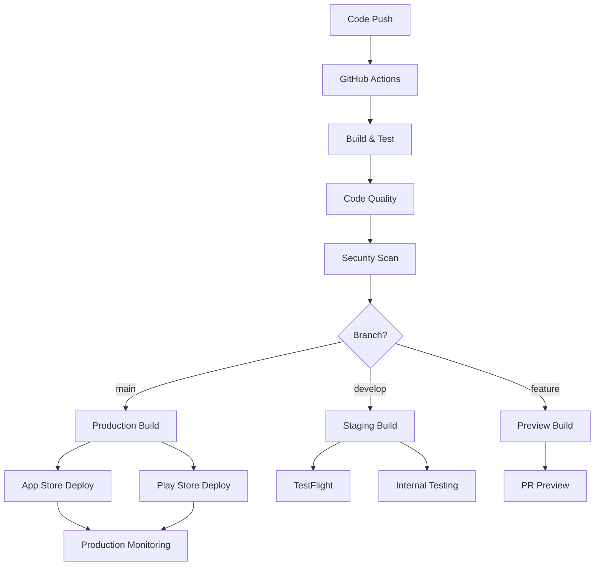
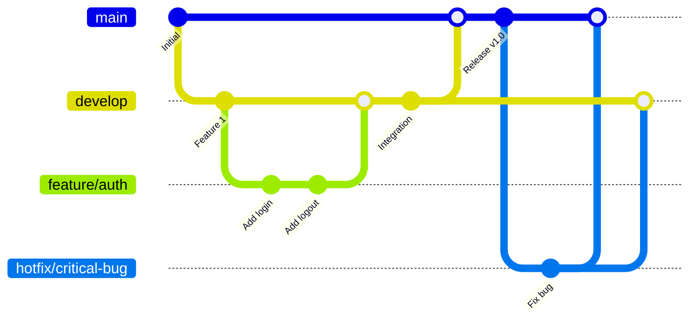

# CI/CD Pipelines

Comprehensive guide to setting up continuous integration and deployment pipelines for React Native applications.

## CI/CD Architecture



## GitHub Actions Setup

### Main Workflow

```yaml
# .github/workflows/ci-cd.yml
name: CI/CD Pipeline

on:
push:
branches: [main, develop]
pull_request:
branches: [main, develop]

env:
NODE_VERSION: '18'
JAVA_VERSION: '11'
XCODE_VERSION: '14.3'

jobs:
test:
name: Test & Quality
runs-on: ubuntu-latest
steps:
  - name: Checkout code
uses: actions/checkout@v4

  - name: Setup Node.js
uses: actions/setup-node@v4
with:
node-version: ${{ env.NODE_VERSION }}
cache: 'npm'

  - name: Install dependencies
run: npm ci

  - name: Run linter
run: npm run lint

  - name: Run type check
run: npm run type-check

  - name: Run tests
run: npm test -- --coverage --watchAll=false

  - name: Upload coverage to Codecov
uses: codecov/codecov-action@v3
with:
file: ./coverage/lcov.info

  - name: SonarCloud Scan
uses: SonarSource/sonarcloud-github-action@master
env:
GITHUB_TOKEN: ${{ secrets.GITHUB_TOKEN }}
SONAR_TOKEN: ${{ secrets.SONAR_TOKEN }}

security:
name: Security Scan
runs-on: ubuntu-latest
steps:
  - name: Checkout code
uses: actions/checkout@v4

  - name: Run Snyk to check for vulnerabilities
uses: snyk/actions/node@master
env:
SNYK_TOKEN: ${{ secrets.SNYK_TOKEN }}
with:
args: --severity-threshold=high

  - name: Upload result to GitHub Code Scanning
uses: github/codeql-action/upload-sarif@v2
with:
sarif_file: snyk.sarif

build-ios:
name: Build iOS
runs-on: macos-latest
needs: [test, security]
if: github.ref == 'refs/heads/main' || github.ref == 'refs/heads/develop'
steps:
  - name: Checkout code
uses: actions/checkout@v4

  - name: Setup Node.js
uses: actions/setup-node@v4
with:
node-version: ${{ env.NODE_VERSION }}
cache: 'npm'

  - name: Setup Xcode
uses: maxim-lobanov/setup-xcode@v1
with:
xcode-version: ${{ env.XCODE_VERSION }}

  - name: Install dependencies
run: npm ci

  - name: Setup Expo
uses: expo/expo-github-action@v8
with:
expo-version: latest
token: ${{ secrets.EXPO_TOKEN }}

  - name: Build iOS app
run: |
    if [ "${{ github.ref }}" = "refs/heads/main" ]; then
    eas build --platform ios --profile production --non-interactive
    else
    eas build --platform ios --profile preview --non-interactive
    fi

build-android:
name: Build Android
runs-on: ubuntu-latest
needs: [test, security]
if: github.ref == 'refs/heads/main' || github.ref == 'refs/heads/develop'
steps:
  - name: Checkout code
uses: actions/checkout@v4

  - name: Setup Node.js
uses: actions/setup-node@v4
with:
node-version: ${{ env.NODE_VERSION }}
cache: 'npm'

  - name: Setup Java
uses: actions/setup-java@v3
with:
distribution: 'temurin'
java-version: ${{ env.JAVA_VERSION }}

  - name: Install dependencies
run: npm ci

  - name: Setup Expo
uses: expo/expo-github-action@v8
with:
expo-version: latest
token: ${{ secrets.EXPO_TOKEN }}

  - name: Build Android app
run: |
    if [ "${{ github.ref }}" = "refs/heads/main" ]; then
    eas build --platform android --profile production --non-interactive
    else
    eas build --platform android --profile preview --non-interactive
    fi

deploy-stores:
name: Deploy to App Stores
runs-on: ubuntu-latest
needs: [build-ios, build-android]
if: github.ref == 'refs/heads/main'
steps:
  - name: Checkout code
uses: actions/checkout@v4

  - name: Setup Expo
uses: expo/expo-github-action@v8
with:
expo-version: latest
token: ${{ secrets.EXPO_TOKEN }}

  - name: Submit to App Store
run: eas submit --platform ios --latest --non-interactive

  - name: Submit to Play Store
run: eas submit --platform android --latest --non-interactive

notify:
name: Notify Team
runs-on: ubuntu-latest
needs: [deploy-stores]
if: always()
steps:
  - name: Notify Slack
uses: 8398a7/action-slack@v3
with:
status: ${{ job.status }}
channel: '#deployments'
webhook_url: ${{ secrets.SLACK_WEBHOOK }}
```

### E2E Testing Workflow

```yaml
# .github/workflows/e2e.yml
name: E2E Tests

on:
schedule:
  - cron: '0 2 * * *' # Run daily at 2 AM
workflow_dispatch:

jobs:
e2e-ios:
name: E2E Tests iOS
runs-on: macos-latest
steps:
  - name: Checkout code
uses: actions/checkout@v4

  - name: Setup Node.js
uses: actions/setup-node@v4
with:
node-version: '18'
cache: 'npm'

  - name: Install dependencies
run: npm ci

  - name: Build iOS app for testing
run: npx detox build --configuration ios.sim.release

  - name: Run E2E tests
run: npx detox test --configuration ios.sim.release --cleanup

  - name: Upload test results
uses: actions/upload-artifact@v3
if: failure()
with:
name: e2e-test-results
path: e2e/artifacts/

e2e-android:
name: E2E Tests Android
runs-on: macos-latest
steps:
  - name: Checkout code
uses: actions/checkout@v4

  - name: Setup Node.js
uses: actions/setup-node@v4
with:
node-version: '18'
cache: 'npm'

  - name: Setup Java
uses: actions/setup-java@v3
with:
distribution: 'temurin'
java-version: '11'

  - name: Install dependencies
run: npm ci

  - name: AVD cache
uses: actions/cache@v3
id: avd-cache
with:
path: |
    ~/.android/avd/*
    ~/.android/adb*
key: avd-29

  - name: Create AVD and generate snapshot for caching
if: steps.avd-cache.outputs.cache-hit != 'true'
uses: reactivecircus/android-emulator-runner@v2
with:
api-level: 29
force-avd-creation: false
emulator-options: -no-window -gpu swiftshader_indirect -noaudio -no-boot-anim -camera-back none
disable-animations: false
script: echo "Generated AVD snapshot for caching."

  - name: Run E2E tests
uses: reactivecircus/android-emulator-runner@v2
with:
api-level: 29
script: |
    npx detox build --configuration android.emu.release
    npx detox test --configuration android.emu.release --cleanup
```

## EAS Build Configuration

### EAS Configuration

```json
// eas.json
{
  "cli": {
    "version": ">= 3.0.0"
  },
  "build": {
    "development": {
      "developmentClient": true,
      "distribution": "internal",
      "ios": {
        "resourceClass": "m1-medium"
      }
    },
    "preview": {
      "distribution": "internal",
      "ios": {
        "simulator": true,
        "resourceClass": "m1-medium"
      },
      "android": {
        "buildType": "apk"
      }
    },
    "production": {
      "ios": {
        "resourceClass": "m1-medium"
      }
    }
  },
  "submit": {
    "production": {
      "ios": {
        "appleId": "your-apple-id@example.com",
        "ascAppId": "1234567890",
        "appleTeamId": "ABCDEFGHIJ"
      },
      "android": {
        "serviceAccountKeyPath": "./google-service-account.json",
        "track": "production"
      }
    }
  }
}
```

### Build Hooks

```javascript
// scripts/eas-build-pre-install.js
#!/usr/bin/env node

const fs = require('fs');
const path = require('path');

// Set environment-specific configurations
const environment = process.env.EAS_BUILD_PROFILE;

console.log(`Running pre-install hook for ${environment} build`);

// Copy environment-specific files
if (environment === 'production') {
  fs.copyFileSync(
    path.join(__dirname, '../config/production.env'),
    path.join(__dirname, '../.env')
  );
} else if (environment === 'preview') {
  fs.copyFileSync(
    path.join(__dirname, '../config/staging.env'),
    path.join(__dirname, '../.env')
  );
}

// Update app configuration
const appConfig = require('../app.json');
if (environment === 'production') {
  appConfig.expo.name = 'MyApp';
  appConfig.expo.slug = 'myapp';
} else {
  appConfig.expo.name = 'MyApp (Preview)';
  appConfig.expo.slug = 'myapp-preview';
}

fs.writeFileSync(
  path.join(__dirname, '../app.json'),
  JSON.stringify(appConfig, null, 2)
);
```

## Environment Management

### Environment Configuration

```typescript
// config/environments.ts
interface Environment {
  API_URL: string;
  WS_URL: string;
  SENTRY_DSN: string;
  ANALYTICS_KEY: string;
  LOG_LEVEL: 'debug' | 'info' | 'warn' | 'error';
}

const environments: Record<string, Environment> = {
  development: {
    API_URL: 'http://localhost:3000/api',
    WS_URL: 'ws://localhost:3000',
    SENTRY_DSN: '',
    ANALYTICS_KEY: '',
    LOG_LEVEL: 'debug',
  },
  staging: {
    API_URL: 'https://staging-api.example.com',
    WS_URL: 'wss://staging-api.example.com',
    SENTRY_DSN: process.env.EXPO_PUBLIC_SENTRY_DSN_STAGING!,
    ANALYTICS_KEY: process.env.EXPO_PUBLIC_ANALYTICS_KEY_STAGING!,
    LOG_LEVEL: 'info',
  },
  production: {
    API_URL: 'https://api.example.com',
    WS_URL: 'wss://api.example.com',
    SENTRY_DSN: process.env.EXPO_PUBLIC_SENTRY_DSN_PRODUCTION!,
    ANALYTICS_KEY: process.env.EXPO_PUBLIC_ANALYTICS_KEY_PRODUCTION!,
    LOG_LEVEL: 'error',
  },
};

const currentEnvironment = process.env.EXPO_PUBLIC_ENVIRONMENT || 'development';

export const config = environments[currentEnvironment];
```

### Secret Management

```yaml
# .github/workflows/secrets.yml
name: Manage Secrets

on:
workflow_dispatch:
inputs:
action:
description: 'Action to perform'
required: true
default: 'update'
type: choice
options:
  - update
  - rotate

jobs:
manage-secrets:
runs-on: ubuntu-latest
steps:
  - name: Update secrets in EAS
run: |
  npx eas secret:create --scope project --name API_KEY --value "${{ secrets.API_KEY }}" --force
  npx eas secret:create --scope project --name DATABASE_URL --value "${{ secrets.DATABASE_URL }}" --force
env:
EXPO_TOKEN: ${{ secrets.EXPO_TOKEN }}
```

## Automated Testing in CI

### Test Configuration

```javascript
// jest.config.ci.js
module.exports = {
  ...require('./jest.config.js'),
  collectCoverage: true,
  coverageReporters: ['text', 'lcov', 'html'],
  coverageThreshold: {
    global: {
      branches: 80,
      functions: 80,
      lines: 80,
      statements: 80,
    },
  },
  testResultsProcessor: 'jest-sonar-reporter',
  reporters: [
    'default',
    [
      'jest-junit',
      {
        outputDirectory: 'test-results',
        outputName: 'junit.xml',
      },
    ],
  ],
};
```

### Performance Testing

```yaml
# .github/workflows/performance.yml
name: Performance Tests

on:
schedule:
  - cron: '0 4 * * 1' # Weekly on Monday at 4 AM
workflow_dispatch:

jobs:
lighthouse:
runs-on: ubuntu-latest
steps:
  - name: Checkout code
uses: actions/checkout@v4

  - name: Setup Node.js
uses: actions/setup-node@v4
with:
node-version: '18'

  - name: Install dependencies
run: npm ci

  - name: Build web version
run: npx expo export:web

  - name: Serve web build
run: npx serve web-build &

  - name: Run Lighthouse CI
run: |
    npm install -g @lhci/cli
    lhci autorun
env:
LHCI_GITHUB_APP_TOKEN: ${{ secrets.LHCI_GITHUB_APP_TOKEN }}

bundle-analysis:
runs-on: ubuntu-latest
steps:
  - name: Checkout code
uses: actions/checkout@v4

  - name: Setup Node.js
uses: actions/setup-node@v4
with:
node-version: '18'

  - name: Install dependencies
run: npm ci

  - name: Analyze bundle
run: |
    npx react-native bundle --platform android --dev false --entry-file index.js --bundle-output android-bundle.js
    npx bundlesize

  - name: Comment bundle size
uses: actions/github-script@v6
with:
script: |
    const fs = require('fs');
    const bundleSize = fs.statSync('android-bundle.js').size;
    const sizeMB = (bundleSize / 1024 / 1024).toFixed(2);

    github.rest.issues.createComment({
issue_number: context.issue.number,
owner: context.repo.owner,
repo: context.repo.repo,
body: `Bundle size: ${sizeMB} MB`
    });
```

## Deployment Strategies

### Blue-Green Deployment

```yaml
# .github/workflows/blue-green.yml
name: Blue-Green Deployment

on:
workflow_dispatch:
inputs:
environment:
description: 'Target environment'
required: true
default: 'staging'
type: choice
options:
  - staging
  - production

jobs:
deploy:
runs-on: ubuntu-latest
steps:
  - name: Deploy to Blue environment
run: |
 # Deploy new version to blue environment
    eas update --branch blue-${{ github.event.inputs.environment }} --message "Blue deployment"

  - name: Run health checks
run: |
 # Run comprehensive health checks
    npm run health-check:blue

  - name: Switch traffic to Blue
if: success()
run: |
 # Switch traffic from green to blue
    eas channel:edit ${{ github.event.inputs.environment }} --branch blue-${{ github.event.inputs.environment }}

  - name: Rollback on failure
if: failure()
run: |
 # Rollback to green environment
    eas channel:edit ${{ github.event.inputs.environment }} --branch green-${{ github.event.inputs.environment }}
```

### Canary Deployment

```yaml
# .github/workflows/canary.yml
name: Canary Deployment

on:
workflow_dispatch:
inputs:
percentage:
description: 'Canary percentage'
required: true
default: '10'
type: choice
options:
  - '10'
  - '25'
  - '50'
  - '100'

jobs:
canary:
runs-on: ubuntu-latest
steps:
  - name: Deploy canary
run: |
    eas update --branch canary --message "Canary deployment ${{ github.event.inputs.percentage }}%"

  - name: Configure traffic split
run: |
 # Configure load balancer for traffic split
 # This would typically involve your infrastructure management tools
    echo "Routing ${{ github.event.inputs.percentage }}% traffic to canary"

  - name: Monitor metrics
run: |
 # Monitor error rates, performance metrics
    npm run monitor:canary

  - name: Promote or rollback
run: |
 # Based on metrics, either promote to 100% or rollback
    if [ "${{ steps.monitor.outcome }}" = "success" ]; then
    eas channel:edit production --branch canary
    else
    echo "Rolling back canary deployment"
    fi
```

## Monitoring and Alerting

### Deployment Monitoring

```typescript
// scripts/deployment-monitor.ts
import { Sentry } from '@sentry/react-native';

interface DeploymentMetrics {
  errorRate: number;
  responseTime: number;
  crashRate: number;
  userSatisfaction: number;
}

class DeploymentMonitor {
  async checkDeploymentHealth(version: string): Promise<boolean> {
    const metrics = await this.getMetrics(version);

    const healthChecks = [
      metrics.errorRate < 0.01, // Less than 1% error rate
      metrics.responseTime < 2000, // Less than 2s response time
      metrics.crashRate < 0.001, // Less than 0.1% crash rate
      metrics.userSatisfaction > 0.95, // More than 95% satisfaction
    ];

    const isHealthy = healthChecks.every(check => check);

    if (!isHealthy) {
      await this.alertTeam(version, metrics);
    }

    return isHealthy;
  }

  private async getMetrics(version: string): Promise<DeploymentMetrics> {
    // Fetch metrics from monitoring services
    // This would integrate with your monitoring stack
    return {
      errorRate: 0.005,
      responseTime: 1500,
      crashRate: 0.0005,
      userSatisfaction: 0.97,
    };
  }

  private async alertTeam(version: string, metrics: DeploymentMetrics) {
    // Send alerts via Slack, email, etc.
    console.error(`Deployment ${version} health check failed:`, metrics);

    Sentry.captureMessage(`Deployment ${version} health check failed`, {
      level: 'error',
      extra: { metrics },
    });
  }
}
```

## Best Practices

### 1. Branch Strategy



### 2. Automated Quality Gates

```yaml
quality-gates:
  - name: "Code Coverage"
threshold: 80%
blocking: true

  - name: "Security Scan"
severity: "high"
blocking: true

  - name: "Performance Budget"
bundle-size: "5MB"
blocking: false

  - name: "Accessibility"
score: 90%
blocking: false
```

### 3. Rollback Strategy

```typescript
// scripts/rollback.ts
interface RollbackPlan {
  version: string;
  strategy: 'immediate' | 'gradual';
  healthChecks: string[];
  rollbackTriggers: string[];
}

const rollbackPlan: RollbackPlan = {
  version: 'v1.2.3',
  strategy: 'immediate',
  healthChecks: ['error-rate', 'crash-rate', 'response-time'],
  rollbackTriggers: ['error-rate > 1%', 'crash-rate > 0.1%', 'response-time > 5s'],
};
```

## Next Steps

1. Set up GitHub Actions workflows for your project
2. Configure EAS Build with proper environment management
3. Implement automated testing in your CI pipeline
4. Set up deployment strategies (blue-green or canary)
5. Add monitoring and alerting for deployments
6. Create rollback procedures and test them regularly

---

**Pro Tip**: Start with a simple CI/CD pipeline and gradually add complexity. Focus on automating the most critical and error-prone processes first, such as testing and basic deployment. Always have a rollback plan and test it regularly.
