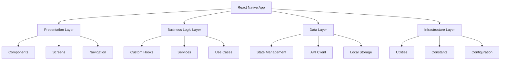
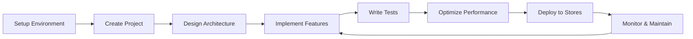

# React Native Production-Grade Hybrid App Guide

Welcome to the comprehensive guide for building production-grade hybrid React Native applications. This documentation covers everything from setup to deployment, following industry best practices.

## Overview

This guide is designed to take you from React Native beginner to production-ready developer. Whether you're building your first mobile app or scaling an existing application, you'll find practical advice, best practices, and real-world examples.

## What You'll Learn

### Development Fundamentals

- Setting up a robust development environment
- Organizing scalable project structures
- Implementing clean architecture patterns
- Managing state effectively across your application

### Production Readiness

- Building secure authentication systems
- Implementing proper error handling and monitoring
- Optimizing performance for mobile devices
- Setting up automated testing and deployment pipelines

### Advanced Topics

- Integrating native modules and platform-specific code
- Implementing offline-first architectures
- Managing real-time data synchronization
- Deploying to app stores with confidence

## Architecture Overview

## Technology Stack

### Core Technologies

- **React Native** 0.79+
- **Expo** SDK 53+
- **TypeScript** 5.8+
- **Node.js** 18+

### Recommended Libraries

#### State Management

- **Zustand** - Lightweight state management
- **React Query** - Server state management
- **MMKV** - Fast key-value storage

#### UI & Styling

- **NativeWind** - Tailwind CSS for React Native
- **React Native Reanimated** - Smooth animations
- **React Native Gesture Handler** - Touch interactions

#### Navigation

- **Expo Router** - File-based routing
- **React Navigation** - Traditional navigation

#### Development Tools

- **ESLint** - Code linting
- **Prettier** - Code formatting
- **Jest** - Unit testing
- **Detox** - End-to-end testing

## Quick Start Paths

### For Beginners

1. [Environment Setup](setup/environment-setup.md)
2. [Project Structure](setup/project-structure.md)
3. [Component Design](architecture/component-design.md)
4. [Styling Systems](ui/styling-systems.md)

### For Intermediate Developers

1. [App Architecture](architecture/app-architecture.md)
2. [State Management](architecture/state-management.md)
3. [API Integration](data/api-integration.md)
4. [Testing](tools/testing.md)

### For Advanced Developers

1. [Performance Optimization](tools/performance.md)
2. [Security Implementation](security/authentication.md)
3. [CI/CD Setup](deployment/cicd.md)
4. [Monitoring & Analytics](monitoring/crash-reporting.md)

## Development Workflow

## Prerequisites

Before diving into this guide, you should have:

- Basic knowledge of **JavaScript/TypeScript**
- Understanding of **React** fundamentals
- Familiarity with **mobile app concepts**
- A computer capable of running development tools

## Getting Help

- **GitHub Issues**: Report documentation bugs and improvements
- **Discussions**: Ask questions and get community support
- **Examples**: Check practical implementations in the examples folder

## Contributing

This documentation is a living resource. Contributions are welcome:

1. **Report Issues**: Found something unclear or outdated?
2. **Suggest Improvements**: Have a better way to explain something?
3. **Add Examples**: Real-world examples are always valuable
4. **Share Best Practices**: Learned something new? Share it with the community

## License

This documentation is open source and available under the MIT License.

---

Ready to build amazing React Native apps? Start with [Environment Setup](setup/environment-setup.md)!
