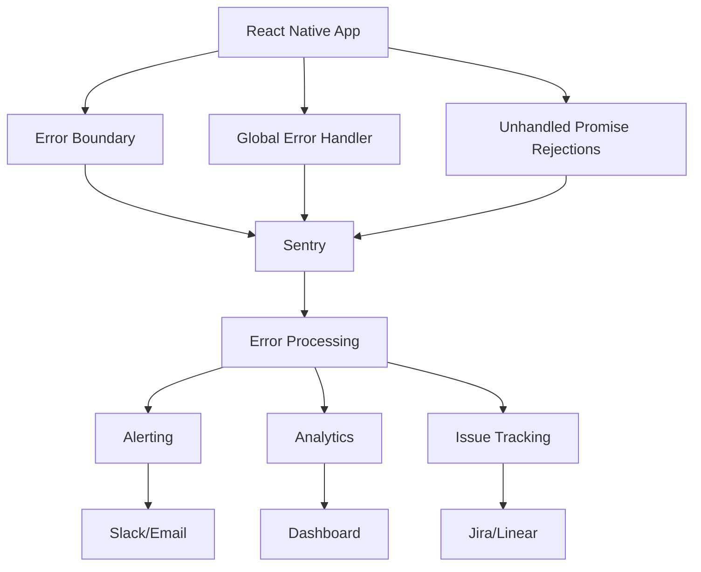

# Crash Reporting

Comprehensive guide to implementing crash reporting and error monitoring in React Native applications for production stability.

## Crash Reporting Architecture



## Sentry Integration

### Installation and Setup

```bash
npm install @sentry/react-native
npx @sentry/wizard -i reactNative -p ios android
```

### Configuration

```typescript
// lib/monitoring/sentry.ts
import * as Sentry from '@sentry/react-native';
import { isRunningInExpoGo } from 'expo';

interface SentryConfig {
  dsn: string;
  environment: string;
  release?: string;
  dist?: string;
}

const sentryConfig: SentryConfig = {
  dsn: process.env.EXPO_PUBLIC_SENTRY_DSN!,
  environment: process.env.EXPO_PUBLIC_ENVIRONMENT || 'development',
  release: process.env.EXPO_PUBLIC_APP_VERSION,
  dist: process.env.EXPO_PUBLIC_BUILD_NUMBER,
};

export function initializeSentry() {
  if (isRunningInExpoGo()) {
    console.log('Skipping Sentry initialization in Expo Go');
    return;
  }

  Sentry.init({
    dsn: sentryConfig.dsn,
    environment: sentryConfig.environment,
    release: sentryConfig.release,
    dist: sentryConfig.dist,

    // Performance monitoring
    tracesSampleRate: sentryConfig.environment === 'production' ? 0.1 : 1.0,

    // Session tracking
    autoSessionTracking: true,

    // Native crash handling
    enableNativeCrashHandling: true,
    enableNativeNagger: false,

    // Debug options
    debug: sentryConfig.environment === 'development',

    // Integrations
    integrations: [
      new Sentry.ReactNativeTracing({
        routingInstrumentation: new Sentry.ReactNavigationInstrumentation(),
        enableNativeFramesTracking: true,
        enableStallTracking: true,
        enableAppStartTracking: true,
      }),
    ],

    // Before send hook for filtering
    beforeSend(event, hint) {
      // Filter out development errors
      if (sentryConfig.environment === 'development') {
        console.log('Sentry Event:', event);
        return null;
      }

      // Filter out known issues
      if (event.exception) {
        const error = hint.originalException;
        if (error instanceof Error) {
          // Skip network errors in development
          if (error.message.includes('Network request failed')) {
            return null;
          }

          // Skip cancelled requests
          if (error.message.includes('cancelled')) {
            return null;
          }
        }
      }

      return event;
    },

    // Before breadcrumb hook
    beforeBreadcrumb(breadcrumb) {
      // Filter sensitive data from breadcrumbs
      if (breadcrumb.category === 'http') {
        // Remove sensitive headers
        if (breadcrumb.data?.headers) {
          delete breadcrumb.data.headers.Authorization;
          delete breadcrumb.data.headers.Cookie;
        }
      }

      return breadcrumb;
    },
  });
}

// User context management
export function setUserContext(user: { id: string; email?: string; username?: string }) {
  Sentry.setUser({
    id: user.id,
    email: user.email,
    username: user.username,
  });
}

export function clearUserContext() {
  Sentry.setUser(null);
}

// Custom error reporting
export function reportError(error: Error, context?: Record<string, any>) {
  Sentry.withScope(scope => {
    if (context) {
      Object.entries(context).forEach(([key, value]) => {
        scope.setContext(key, value);
      });
    }

    Sentry.captureException(error);
  });
}

// Performance monitoring
export function startTransaction(name: string, operation: string) {
  return Sentry.startTransaction({ name, op: operation });
}

export function addBreadcrumb(message: string, category: string, data?: any) {
  Sentry.addBreadcrumb({
    message,
    category,
    data,
    level: 'info',
  });
}
```

### Error Boundaries with Sentry

```typescript
// components/SentryErrorBoundary.tsx
import * as Sentry from '@sentry/react-native';

interface SentryErrorBoundaryState {
  hasError: boolean;
  eventId?: string;
}

export class SentryErrorBoundary extends React.Component<
React.PropsWithChildren<{}>,
SentryErrorBoundaryState
> {
  constructor(props: React.PropsWithChildren<{}>) {
    super(props);
    this.state = { hasError: false };
  }

  static getDerivedStateFromError(error: Error): SentryErrorBoundaryState {
    return { hasError: true };
  }

  componentDidCatch(error: Error, errorInfo: React.ErrorInfo) {
    const eventId = Sentry.captureException(error, {
      contexts: {
        react: {
          componentStack: errorInfo.componentStack,
        },
      },
    });

    this.setState({ eventId });
  }

  render() {
    if (this.state.hasError) {
      return (
        <View className="flex-1 items-center justify-center p-4">
          <Text className="text-lg font-semibold mb-2">
            Something went wrong
          </Text>
          <Text className="text-gray-600 text-center mb-4">
            We've been notified about this error and are working to fix it.
          </Text>
          <Button
            onPress={() => this.setState({ hasError: false })}
            className="mb-2"
            >
            Try Again
          </Button>
          {this.state.eventId && (
            <Button
              variant="outline"
              onPress={() => {
                Sentry.showReportDialog({ eventId: this.state.eventId! });
              }}
              >
              Report Feedback
            </Button>
          )}
        </View>
      );
    }

    return this.props.children;
  }
}

// HOC for wrapping screens
export function withSentryErrorBoundary<P extends object>(
  WrappedComponent: React.ComponentType<P>,
  options?: { fallback?: React.ComponentType }
) {
  return function SentryWrappedComponent(props: P) {
    return (
      <SentryErrorBoundary>
        <WrappedComponent {...props} />
      </SentryErrorBoundary>
    );
  };
}
```

## Global Error Handling

### JavaScript Error Handler

```typescript
// lib/monitoring/errorHandler.ts
import { ErrorUtils } from 'react-native';
import * as Sentry from '@sentry/react-native';

interface ErrorContext {
  userId?: string;
  screen?: string;
  action?: string;
  metadata?: Record<string, any>;
}

class GlobalErrorHandler {
  private originalHandler: any;
  private errorContext: ErrorContext = {};

  initialize() {
    this.setupJavaScriptErrorHandler();
    this.setupPromiseRejectionHandler();
    this.setupConsoleErrorCapture();
  }

  setContext(context: Partial<ErrorContext>) {
    this.errorContext = { ...this.errorContext, ...context };
  }

  clearContext() {
    this.errorContext = {};
  }

  private setupJavaScriptErrorHandler() {
    this.originalHandler = ErrorUtils.getGlobalHandler();

    ErrorUtils.setGlobalHandler((error: any, isFatal: boolean) => {
      console.error('Global JavaScript error:', error);

      // Report to Sentry
      Sentry.withScope(scope => {
        scope.setTag('errorType', 'javascript');
        scope.setTag('isFatal', isFatal);
        scope.setContext('errorContext', this.errorContext);

        if (this.errorContext.userId) {
          scope.setUser({ id: this.errorContext.userId });
        }

        Sentry.captureException(error);
      });

      // Call original handler
      this.originalHandler(error, isFatal);
    });
  }

  private setupPromiseRejectionHandler() {
    const tracking = require('promise/setimmediate/rejection-tracking');

    tracking.enable({
      allRejections: true,
      onUnhandled: (id: string, error: Error) => {
        console.error('Unhandled promise rejection:', error);

        Sentry.withScope(scope => {
          scope.setTag('errorType', 'unhandledPromise');
          scope.setContext('promiseRejection', { id });
          scope.setContext('errorContext', this.errorContext);

          Sentry.captureException(error);
        });
      },
      onHandled: (id: string) => {
        console.log('Promise rejection handled:', id);
      },
    });
  }

  private setupConsoleErrorCapture() {
    const originalConsoleError = console.error;

    console.error = (...args: any[]) => {
      // Call original console.error
      originalConsoleError.apply(console, args);

      // Capture console errors in production
      if (process.env.NODE_ENV === 'production') {
        const message = args
          .map(arg => (typeof arg === 'string' ? arg : JSON.stringify(arg)))
          .join(' ');

        Sentry.addBreadcrumb({
          message,
          category: 'console',
          level: 'error',
        });
      }
    };
  }
}

export const globalErrorHandler = new GlobalErrorHandler();
```

### Network Error Handling

```typescript
// lib/monitoring/networkErrorHandler.ts
interface NetworkError {
  url: string;
  method: string;
  status?: number;
  statusText?: string;
  responseTime: number;
  error: Error;
}

class NetworkErrorHandler {
  private errorCounts = new Map<string, number>();
  private readonly MAX_ERRORS_PER_ENDPOINT = 5;

  reportNetworkError(networkError: NetworkError) {
    const endpointKey = `${networkError.method}:${networkError.url}`;
    const currentCount = this.errorCounts.get(endpointKey) || 0;

    // Avoid spam by limiting reports per endpoint
    if (currentCount >= this.MAX_ERRORS_PER_ENDPOINT) {
      return;
    }

    this.errorCounts.set(endpointKey, currentCount + 1);

    Sentry.withScope(scope => {
      scope.setTag('errorType', 'network');
      scope.setContext('networkRequest', {
        url: networkError.url,
        method: networkError.method,
        status: networkError.status,
        statusText: networkError.statusText,
        responseTime: networkError.responseTime,
      });

      // Set fingerprint for grouping similar network errors
      scope.setFingerprint([
        'network-error',
        networkError.method,
        networkError.url,
        networkError.status?.toString() || 'unknown',
      ]);

      Sentry.captureException(networkError.error);
    });
  }

  resetErrorCounts() {
    this.errorCounts.clear();
  }
}

export const networkErrorHandler = new NetworkErrorHandler();
```

## Custom Error Types

### Structured Error Classes

```typescript
// lib/errors/AppError.ts
export enum ErrorCode {
  NETWORK_ERROR = 'NETWORK_ERROR',
  AUTHENTICATION_ERROR = 'AUTHENTICATION_ERROR',
  VALIDATION_ERROR = 'VALIDATION_ERROR',
  PERMISSION_ERROR = 'PERMISSION_ERROR',
  NOT_FOUND_ERROR = 'NOT_FOUND_ERROR',
  SERVER_ERROR = 'SERVER_ERROR',
  UNKNOWN_ERROR = 'UNKNOWN_ERROR',
}

export class AppError extends Error {
  public readonly code: ErrorCode;
  public readonly statusCode?: number;
  public readonly context?: Record<string, any>;
  public readonly timestamp: Date;

  constructor(
    message: string,
    code: ErrorCode,
    statusCode?: number,
    context?: Record<string, any>
  ) {
    super(message);
    this.name = 'AppError';
    this.code = code;
    this.statusCode = statusCode;
    this.context = context;
    this.timestamp = new Date();
  }

  toJSON() {
    return {
      name: this.name,
      message: this.message,
      code: this.code,
      statusCode: this.statusCode,
      context: this.context,
      timestamp: this.timestamp,
      stack: this.stack,
    };
  }
}

export class NetworkError extends AppError {
  constructor(message: string, statusCode?: number, context?: Record<string, any>) {
    super(message, ErrorCode.NETWORK_ERROR, statusCode, context);
    this.name = 'NetworkError';
  }
}

export class AuthenticationError extends AppError {
  constructor(message: string = 'Authentication required', context?: Record<string, any>) {
    super(message, ErrorCode.AUTHENTICATION_ERROR, 401, context);
    this.name = 'AuthenticationError';
  }
}

export class ValidationError extends AppError {
  constructor(message: string, context?: Record<string, any>) {
    super(message, ErrorCode.VALIDATION_ERROR, 400, context);
    this.name = 'ValidationError';
  }
}
```

### Error Factory

```typescript
// lib/errors/errorFactory.ts
export class ErrorFactory {
  static createFromApiError(apiError: any): AppError {
    const { status, data, message } = apiError;

    switch (status) {
      case 400:
        return new ValidationError(data?.message || 'Invalid request data', {
          originalError: apiError,
        });
      case 401:
        return new AuthenticationError(data?.message || 'Authentication required', {
          originalError: apiError,
        });
      case 403:
        return new AppError(data?.message || 'Access denied', ErrorCode.PERMISSION_ERROR, 403, {
          originalError: apiError,
        });
      case 404:
        return new AppError(data?.message || 'Resource not found', ErrorCode.NOT_FOUND_ERROR, 404, {
          originalError: apiError,
        });
      case 500:
      default:
        return new AppError(
          data?.message || message || 'Server error occurred',
          ErrorCode.SERVER_ERROR,
          status,
          { originalError: apiError }
        );
    }
  }

  static createFromNetworkError(error: Error, context?: Record<string, any>): NetworkError {
    return new NetworkError(error.message || 'Network request failed', undefined, {
      ...context,
      originalError: error,
    });
  }
}
```

## Performance Monitoring

### Performance Tracking

```typescript
// lib/monitoring/performance.ts
interface PerformanceMetric {
  name: string;
  value: number;
  unit: string;
  tags?: Record<string, string>;
}

class PerformanceMonitor {
  private metrics: PerformanceMetric[] = [];

  trackMetric(metric: PerformanceMetric) {
    this.metrics.push(metric);

    // Report to Sentry
    Sentry.addBreadcrumb({
      message: `Performance: ${metric.name}`,
      category: 'performance',
      data: {
        value: metric.value,
        unit: metric.unit,
        tags: metric.tags,
      },
    });

    // Report slow operations
    if (metric.name.includes('duration') && metric.value > 1000) {
      Sentry.captureMessage(`Slow operation detected: ${metric.name}`, {
        level: 'warning',
        extra: metric,
      });
    }
  }

  trackScreenLoad(screenName: string, duration: number) {
    this.trackMetric({
      name: 'screen_load_duration',
      value: duration,
      unit: 'ms',
      tags: { screen: screenName },
    });
  }

  trackApiCall(endpoint: string, duration: number, status: number) {
    this.trackMetric({
      name: 'api_call_duration',
      value: duration,
      unit: 'ms',
      tags: {
        endpoint,
        status: status.toString(),
        success: status < 400 ? 'true' : 'false',
      },
    });
  }

  trackMemoryUsage() {
    if (performance.memory) {
      this.trackMetric({
        name: 'memory_usage',
        value: performance.memory.usedJSHeapSize,
        unit: 'bytes',
      });
    }
  }

  getMetrics(): PerformanceMetric[] {
    return [...this.metrics];
  }

  clearMetrics() {
    this.metrics = [];
  }
}

export const performanceMonitor = new PerformanceMonitor();
```

## Alerting and Notifications

### Alert Configuration

```typescript
// lib/monitoring/alerts.ts
interface AlertRule {
  name: string;
  condition: (error: Error) => boolean;
  severity: 'low' | 'medium' | 'high' | 'critical';
  channels: ('slack' | 'email' | 'sms')[];
  throttle?: number; // minutes
}

class AlertManager {
  private rules: AlertRule[] = [
    {
      name: 'Critical App Crash',
      condition: error =>
        error.message.includes('ReferenceError') || error.message.includes('TypeError'),
      severity: 'critical',
      channels: ['slack', 'email', 'sms'],
      throttle: 5,
    },
    {
      name: 'Authentication Failure',
      condition: error => error instanceof AuthenticationError,
      severity: 'high',
      channels: ['slack', 'email'],
      throttle: 15,
    },
    {
      name: 'Network Error Spike',
      condition: error => error instanceof NetworkError,
      severity: 'medium',
      channels: ['slack'],
      throttle: 30,
    },
  ];

  private lastAlerts = new Map<string, number>();

  processError(error: Error) {
    for (const rule of this.rules) {
      if (rule.condition(error)) {
        this.triggerAlert(rule, error);
      }
    }
  }

  private triggerAlert(rule: AlertRule, error: Error) {
    const now = Date.now();
    const lastAlert = this.lastAlerts.get(rule.name) || 0;
    const throttleMs = (rule.throttle || 0) * 60 * 1000;

    if (now - lastAlert < throttleMs) {
      return; // Throttled
    }

    this.lastAlerts.set(rule.name, now);

    // Send alert through configured channels
    rule.channels.forEach(channel => {
      this.sendAlert(channel, rule, error);
    });
  }

  private async sendAlert(channel: string, rule: AlertRule, error: Error) {
    const alertData = {
      rule: rule.name,
      severity: rule.severity,
      error: error.message,
      timestamp: new Date().toISOString(),
    };

    switch (channel) {
      case 'slack':
        await this.sendSlackAlert(alertData);
        break;
      case 'email':
        await this.sendEmailAlert(alertData);
        break;
      case 'sms':
        await this.sendSMSAlert(alertData);
        break;
    }
  }

  private async sendSlackAlert(alertData: any) {
    // Implement Slack webhook integration
    console.log('Slack alert:', alertData);
  }

  private async sendEmailAlert(alertData: any) {
    // Implement email service integration
    console.log('Email alert:', alertData);
  }

  private async sendSMSAlert(alertData: any) {
    // Implement SMS service integration
    console.log('SMS alert:', alertData);
  }
}

export const alertManager = new AlertManager();
```

## Error Analytics

### Error Metrics Dashboard

```typescript
// lib/monitoring/analytics.ts
interface ErrorMetrics {
  totalErrors: number;
  errorsByType: Record<string, number>;
  errorsByScreen: Record<string, number>;
  errorTrends: Array<{ date: string; count: number }>;
  topErrors: Array<{ message: string; count: number; lastSeen: Date }>;
}

class ErrorAnalytics {
  private errors: Array<{
    error: Error;
    timestamp: Date;
    screen?: string;
    userId?: string;
  }> = [];

  recordError(error: Error, context?: { screen?: string; userId?: string }) {
    this.errors.push({
      error,
      timestamp: new Date(),
      screen: context?.screen,
      userId: context?.userId,
    });

    // Keep only last 1000 errors in memory
    if (this.errors.length > 1000) {
      this.errors = this.errors.slice(-1000);
    }
  }

  getMetrics(): ErrorMetrics {
    const totalErrors = this.errors.length;

    const errorsByType = this.errors.reduce(
      (acc, { error }) => {
        const type = error.constructor.name;
        acc[type] = (acc[type] || 0) + 1;
        return acc;
      },
      {} as Record<string, number>
    );

    const errorsByScreen = this.errors.reduce(
      (acc, { screen }) => {
        if (screen) {
          acc[screen] = (acc[screen] || 0) + 1;
        }
        return acc;
      },
      {} as Record<string, number>
    );

    const errorTrends = this.calculateTrends();
    const topErrors = this.getTopErrors();

    return {
      totalErrors,
      errorsByType,
      errorsByScreen,
      errorTrends,
      topErrors,
    };
  }

  private calculateTrends(): Array<{ date: string; count: number }> {
    const last7Days = Array.from({ length: 7 }, (_, i) => {
      const date = new Date();
      date.setDate(date.getDate() - i);
      return date.toISOString().split('T')[0];
    }).reverse();

    return last7Days.map(date => ({
      date,
      count: this.errors.filter(({ timestamp }) => timestamp.toISOString().split('T')[0] === date)
        .length,
    }));
  }

  private getTopErrors(): Array<{ message: string; count: number; lastSeen: Date }> {
    const errorCounts = new Map<string, { count: number; lastSeen: Date }>();

    this.errors.forEach(({ error, timestamp }) => {
      const message = error.message;
      const existing = errorCounts.get(message);

      if (existing) {
        existing.count++;
        if (timestamp > existing.lastSeen) {
          existing.lastSeen = timestamp;
        }
      } else {
        errorCounts.set(message, { count: 1, lastSeen: timestamp });
      }
    });

    return Array.from(errorCounts.entries())
      .map(([message, data]) => ({ message, ...data }))
      .sort((a, b) => b.count - a.count)
      .slice(0, 10);
  }
}

export const errorAnalytics = new ErrorAnalytics();
```

## Best Practices

### 1. Error Context

```typescript
// Always provide context with errors
Sentry.withScope(scope => {
  scope.setContext('userAction', {
    action: 'login',
    screen: 'LoginScreen',
    timestamp: Date.now(),
  });

  scope.setUser({
    id: user.id,
    email: user.email,
  });

  Sentry.captureException(error);
});
```

### 2. Error Filtering

```typescript
// Filter out noise and focus on actionable errors
const shouldReportError = (error: Error): boolean => {
  // Don't report network errors in development
  if (__DEV__ && error.message.includes('Network')) {
    return false;
  }

  // Don't report cancelled requests
  if (error.message.includes('cancelled')) {
    return false;
  }

  // Don't report user-initiated actions
  if (error.message.includes('User cancelled')) {
    return false;
  }

  return true;
};
```

### 3. Privacy Protection

```typescript
// Sanitize sensitive data before reporting
const sanitizeError = (error: any) => {
  if (error.config?.headers) {
    delete error.config.headers.Authorization;
    delete error.config.headers.Cookie;
  }

  if (error.request?.responseText) {
    // Remove sensitive data from response
    error.request.responseText = '[REDACTED]';
  }

  return error;
};
```

## Next Steps

1. Set up Sentry or another crash reporting service
2. Implement global error handlers for comprehensive coverage
3. Create custom error types for better categorization
4. Add performance monitoring to track app health
5. Configure alerting rules for critical errors
6. Build error analytics dashboard for insights

---

**Pro Tip**: Start with basic crash reporting and gradually add more sophisticated error handling and monitoring. Focus on actionable errors and avoid noise. Always protect user privacy by sanitizing sensitive data before reporting.
