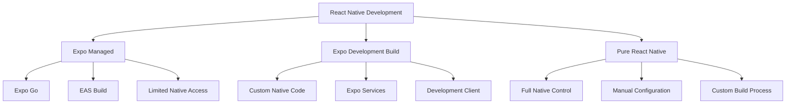
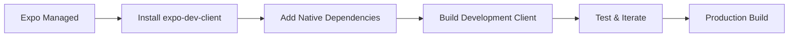

# Expo vs Pure React Native

Comprehensive comparison and migration guide for choosing between Expo and pure React Native development approaches.

## Overview Comparison



## Feature Comparison

| Feature                  | Expo Managed      | Expo Development Build | Pure React Native |
| ------------------------ | ----------------- | ---------------------- | ----------------- |
| **Setup Time**           | Minutes           | Hours                  | Hours/Days        |
| **Native Modules**       | Expo modules only | Any module             | Any module        |
| **Build Process**        | EAS Build         | EAS Build or local     | Local/CI          |
| **OTA Updates**          | Expo Updates      | Expo Updates           | CodePush/Custom   |
| **App Store Deployment** | Automated         | Automated              | Manual            |
| **Bundle Size**          | Larger            | Medium                 | Smallest          |
| **Customization**        | Limited           | High                   | Complete          |
| **Learning Curve**       | Easy              | Medium                 | Steep             |

## Expo Managed Workflow

### Advantages

- **Rapid Development**: Get started in minutes
- **Simplified Build Process**: No need to manage native code
- **Automatic Updates**: Over-the-air updates built-in
- **Cross-platform**: Write once, run everywhere
- **Rich Ecosystem**: Pre-built modules for common features

### Limitations

- **Limited Native Access**: Can't use arbitrary native modules
- **Bundle Size**: Includes unused Expo modules
- **Customization**: Limited native customization options
- **Dependency**: Tied to Expo's release cycle

### When to Choose Expo Managed

```typescript
// Good for:
// - Prototypes and MVPs
// - Apps using standard features (camera, location, notifications)
// - Teams without native development experience
// - Rapid iteration and testing

// Example: Simple social media app
import { Camera } from 'expo-camera';
import { Location } from 'expo-location';
import { Notifications } from 'expo-notifications';

function SocialApp() {
// All these work out of the box with Expo
  const [hasPermission] = Camera.useCameraPermissions();
  const [location] = Location.useLocationAsync();

  return (
    <View>
      <Camera style={{ flex: 1 }} />
      <Text>Location: {location?.coords.latitude}</Text>
    </View>
  );
}
```

## Expo Development Build

### Setup Process

```bash
# Install development build
npx expo install expo-dev-client

# Create development build
eas build --profile development --platform ios
eas build --profile development --platform android

# Or build locally
npx expo run:ios
npx expo run:android
```

### Configuration

```json
// eas.json
{
  "cli": {
    "version": ">= 3.0.0"
  },
  "build": {
    "development": {
      "developmentClient": true,
      "distribution": "internal"
    },
    "preview": {
      "distribution": "internal"
    },
    "production": {}
  }
}
```

### Adding Native Modules

```bash
# Install any React Native module
npm install react-native-ble-plx

# For iOS, install pods
cd ios && pod install

# Rebuild development client
eas build --profile development --platform ios
```

### Custom Native Code

```typescript
// You can now add custom native modules
import { NativeModules } from 'react-native';

// Custom native module
const { CustomBluetooth } = NativeModules;

function BluetoothComponent() {
  const scanDevices = async () => {
    try {
      const devices = await CustomBluetooth.scanForDevices();
      console.log('Found devices:', devices);
    } catch (error) {
      console.error('Bluetooth scan failed:', error);
    }
  };

  return (
    <Button onPress={scanDevices} title="Scan Bluetooth Devices" />
  );
}
```

## Pure React Native

### Project Setup

```bash
# Create new project
npx react-native init MyApp --template react-native-template-typescript

# Install dependencies
cd MyApp
npm install

# Ios Setup
cd ios && pod install && cd ..

# Run on devices
npx react-native run-ios
npx react-native run-android
```

### Native Module Integration

```bash
# Install native module
npm install react-native-camera

# Ios - Add to Podfile
cd ios
pod install

# Android - Manual linking (if required)
# Add to android/settings.gradle
include ':react-native-camera'
project(':react-native-camera').projectDir = new File(rootProject.projectDir, '../node_modules/react-native-camera/android')

# Add to android/app/build.gradle
dependencies {
implementation project(':react-native-camera')
}
```

### Custom Native Modules

```java
// Android - CustomModule.java
package com.myapp;

import com.facebook.react.bridge.ReactApplicationContext;
import com.facebook.react.bridge.ReactContextBaseJavaModule;
import com.facebook.react.bridge.ReactMethod;
import com.facebook.react.bridge.Promise;

public class CustomModule extends ReactContextBaseJavaModule {
  CustomModule(ReactApplicationContext context) {
    super(context);
  }

  @Override
  public String getName() {
    return "CustomModule";
  }

  @ReactMethod
  public void getDeviceInfo(Promise promise) {
    try {
      String deviceInfo = android.os.Build.MODEL;
      promise.resolve(deviceInfo);
    } catch (Exception e) {
      promise.reject("ERROR", e);
    }
  }
}
```

```objc
// iOS - CustomModule.m
#import "CustomModule.h"
#import <React/RCTLog.h>

@implementation CustomModule

RCT_EXPORT_MODULE();

RCT_EXPORT_METHOD(getDeviceInfo:(RCTPromiseResolveBlock)resolve
        rejecter:(RCTPromiseRejectBlock)reject)
{
  NSString *deviceInfo = [[UIDevice currentDevice] model];
  resolve(deviceInfo);
}

@end
```

## Migration Strategies

### From Expo Managed to Development Build



#### Step-by-Step Migration

```bash
# 1. Install Development Client
npx expo install expo-dev-client

# 2. Generate Native Code
npx expo prebuild

# 3. Add Native Dependencies
npm install react-native-ble-plx
cd ios && pod install

# 4. Build Development Client
eas build --profile development --platform ios

# 5. Test Your App
npx expo start --dev-client
```

### From Expo to Pure React Native

```bash
# 1. Eject From Expo (deprecated Approach)
# Use prebuild instead:
npx expo prebuild

# 2. Remove Expo Dependencies
npm uninstall expo

# 3. Update Entry Point
# Change from expo-router/entry to your own index.js

# 4. Update Build Scripts
# Remove Expo-specific scripts from package.json

# 5. Handle Expo Modules
# Replace with React Native alternatives:
# Expo-camera -> React-native-camera
# Expo-location -> @react-native-community/geolocation
# Expo-notifications -> @react-native-firebase/messaging
```

### Module Replacement Guide

| Expo Module            | React Native Alternative              |
| ---------------------- | ------------------------------------- |
| `expo-camera`          | `react-native-vision-camera`          |
| `expo-location`        | `@react-native-community/geolocation` |
| `expo-notifications`   | `@react-native-firebase/messaging`    |
| `expo-image-picker`    | `react-native-image-picker`           |
| `expo-linear-gradient` | `react-native-linear-gradient`        |
| `expo-blur`            | `@react-native-blur/blur`             |
| `expo-haptics`         | `react-native-haptic-feedback`        |

## Decision Framework

### Choose Expo Managed When:

- Building prototypes or MVPs
- Team lacks native development experience
- Using standard mobile features only
- Need rapid development and deployment
- Don't require custom native functionality

### Choose Expo Development Build When:

- Need custom native modules
- Want Expo's developer experience
- Require specific native functionality
- Building production apps with custom requirements
- Want to gradually migrate from managed workflow

### Choose Pure React Native When:

- Need maximum control over native code
- Building complex, performance-critical apps
- Have experienced native developers
- Require extensive customization
- Want smallest possible bundle size

## Performance Considerations

### Bundle Size Comparison

```bash
# Expo Managed (includes all Expo modules)
# Ios: ~50-80mb
# Android: ~30-50MB

# Expo Development Build (only used modules)
# Ios: ~20-40mb
# Android: ~15-25MB

# Pure React Native (minimal dependencies)
# Ios: ~10-20mb
# Android: ~8-15MB
```

### Runtime Performance

```typescript
// Expo modules are optimized but include overhead
import { Camera } from 'expo-camera';

// Pure React Native modules are typically lighter
import { RNCamera } from 'react-native-camera';

// Benchmark example
const ExpoCamera = () => (
  <Camera style={{ flex: 1 }} type={Camera.Constants.Type.back} />
);

const PureRNCamera = () => (
  <RNCamera style={{ flex: 1 }} type={RNCamera.Constants.Type.back} />
);
```

## Best Practices

### 1. Start with Expo Development Build

```typescript
// Begin with development build for flexibility
// You can always add more native code later

// app.json
{
  "expo": {
    "name": "My App",
    "plugins": [
      "expo-dev-client",
// Add plugins as needed
      "expo-camera",
      "expo-location"
    ]
  }
}
```

### 2. Plan Your Native Requirements

```typescript
// Audit your app's native requirements early
const nativeRequirements = {
  camera: 'expo-camera', // Available in Expo
  bluetooth: 'react-native-ble-plx', // Requires development build
  customSecurity: 'custom-native-module', // Requires pure RN
  backgroundProcessing: 'custom-implementation', // Requires pure RN
};
```

### 3. Gradual Migration

```typescript
// Migrate incrementally
// 1. Start with Expo managed
// 2. Move to development build when needed
// 3. Consider pure RN for specific requirements

// Keep migration path open
const migrationStrategy = {
  phase1: 'expo-managed', // MVP
  phase2: 'expo-dev-build', // Add native modules
  phase3: 'pure-rn', // Full control (if needed)
};
```

## Next Steps

1. Evaluate your app's native requirements
2. Choose the appropriate approach based on your needs
3. Set up your development environment accordingly
4. Plan migration strategy for future requirements
5. Consider team expertise and project timeline

---

**Pro Tip**: Start with Expo Development Build for new projects. It provides the best balance of developer experience and flexibility, allowing you to add native functionality as needed without major architectural changes.
