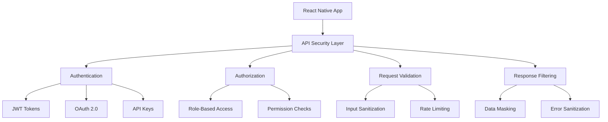

# API Security

Guide to implementing secure API communication in React Native applications.

## API Security Architecture



## Secure API Communication

### HTTPS Enforcement

```typescript
// lib/api/secureClient.ts
export class SecureApiClient {
  private baseURL: string;

  constructor() {
    // Always use HTTPS in production
    this.baseURL =
      process.env.NODE_ENV === 'production'
        ? 'https://api.example.com'
        : 'https://staging-api.example.com';
  }

  async secureRequest<T>(endpoint: string, options: RequestInit = {}): Promise<T> {
    const url = `${this.baseURL}${endpoint}`;

    // Ensure HTTPS
    if (!url.startsWith('https://')) {
      throw new Error('Only HTTPS requests are allowed');
    }

    const response = await fetch(url, {
      ...options,
      headers: {
        'Content-Type': 'application/json',
        'X-Requested-With': 'XMLHttpRequest',
        ...options.headers,
      },
    });

    if (!response.ok) {
      throw new Error(`HTTP ${response.status}: ${response.statusText}`);
    }

    return response.json();
  }
}
```

### Request Signing

```typescript
// lib/security/requestSigning.ts
import CryptoJS from 'crypto-js';

export class RequestSigner {
  private static readonly SECRET_KEY = process.env.EXPO_PUBLIC_API_SECRET;

  static signRequest(method: string, url: string, body: string, timestamp: number): string {
    const message = `${method}${url}${body}${timestamp}`;
    return CryptoJS.HmacSHA256(message, this.SECRET_KEY).toString();
  }

  static verifySignature(
    signature: string,
    method: string,
    url: string,
    body: string,
    timestamp: number
  ): boolean {
    const expectedSignature = this.signRequest(method, url, body, timestamp);
    return signature === expectedSignature;
  }
}
```

## Best Practices

1. **Always use HTTPS** for API communication
2. **Implement request signing** for critical operations
3. **Validate all inputs** before sending to API
4. **Handle errors securely** without exposing sensitive information
5. **Use proper authentication** mechanisms (JWT, OAuth)
6. **Implement rate limiting** to prevent abuse

---

**Pro Tip**: Never expose API secrets in client-side code. Use environment variables and secure key management.
