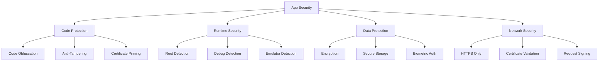

# App Security

Comprehensive guide to implementing security measures in React Native applications.

## Security Architecture



## Code Protection

### Code Obfuscation

```javascript
// metro.config.js
module.exports = {
  transformer: {
    minifierConfig: {
      mangle: {
        keep_fnames: true,
      },
      output: {
        ascii_only: true,
        quote_keys: true,
        wrap_iife: true,
      },
      sourceMap: false,
      toplevel: false,
      warnings: false,
    },
  },
};
```

### Anti-Tampering

```typescript
// lib/security/antiTampering.ts
export class AntiTampering {
  static checkIntegrity(): boolean {
    // Check if app is running in debug mode
    if (__DEV__) {
      console.warn('App is running in debug mode');
      return false;
    }

    // Check for common debugging tools
    const debuggerDetected = this.detectDebugger();
    if (debuggerDetected) {
      console.warn('Debugger detected');
      return false;
    }

    return true;
  }

  private static detectDebugger(): boolean {
    // Simple debugger detection
    let start = Date.now();
    debugger;
    let end = Date.now();
    return end - start > 100;
  }
}
```

## Runtime Security

### Root/Jailbreak Detection

```typescript
// lib/security/rootDetection.ts
import { Platform } from 'react-native';

export class RootDetection {
  static async isDeviceCompromised(): Promise<boolean> {
    if (Platform.OS === 'ios') {
      return this.checkJailbreak();
    } else {
      return this.checkRoot();
    }
  }

  private static checkJailbreak(): boolean {
    // Check for common jailbreak indicators
    const jailbreakPaths = ['/Applications/Cydia.app', '/usr/sbin/sshd', '/bin/bash', '/etc/apt'];

    // This is a simplified check - use a proper library in production
    return false; // Placeholder
  }

  private static checkRoot(): boolean {
    // Check for common root indicators
    const rootPaths = [
      '/system/bin/su',
      '/system/xbin/su',
      '/sbin/su',
      '/system/app/Superuser.apk',
    ];

    // This is a simplified check - use a proper library in production
    return false; // Placeholder
  }
}
```

## Best Practices

1. **Enable code obfuscation** for production builds
2. **Implement certificate pinning** for API communication
3. **Detect compromised devices** (rooted/jailbroken)
4. **Use secure storage** for sensitive data
5. **Implement proper session management**
6. **Regular security audits** and penetration testing

---

**Pro Tip**: Security is a layered approach. Implement multiple security measures rather than relying on a single solution.
