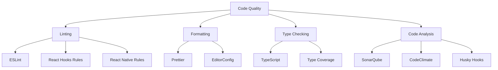

# Code Quality

Comprehensive guide to maintaining high code quality in React Native applications through linting, formatting, and automated quality checks.

## Code Quality Tools Overview



## ESLint Configuration

### Installation

```bash
npm install --save-dev eslint @typescript-eslint/parser @typescript-eslint/eslint-plugin
npm install --save-dev eslint-plugin-react eslint-plugin-react-hooks eslint-plugin-react-native
npm install --save-dev eslint-plugin-import eslint-plugin-jsx-a11y
```

### Configuration

```javascript
// eslint.config.js
import js from '@eslint/js';
import typescript from '@typescript-eslint/eslint-plugin';
import typescriptParser from '@typescript-eslint/parser';
import react from 'eslint-plugin-react';
import reactHooks from 'eslint-plugin-react-hooks';
import reactNative from 'eslint-plugin-react-native';
import importPlugin from 'eslint-plugin-import';

export default [
  js.configs.recommended,
  {
    files: ['**/*.{js,jsx,ts,tsx}'],
    languageOptions: {
      parser: typescriptParser,
      parserOptions: {
        ecmaVersion: 2022,
        sourceType: 'module',
        ecmaFeatures: {
          jsx: true,
        },
      },
    },
    plugins: {
      '@typescript-eslint': typescript,
      react,
      'react-hooks': reactHooks,
      'react-native': reactNative,
      import: importPlugin,
    },
    rules: {
      // TypeScript rules
      '@typescript-eslint/no-unused-vars': 'error',
      '@typescript-eslint/no-explicit-any': 'warn',
      '@typescript-eslint/explicit-function-return-type': 'off',
      '@typescript-eslint/explicit-module-boundary-types': 'off',
      '@typescript-eslint/no-non-null-assertion': 'warn',

      // React rules
      'react/jsx-uses-react': 'off',
      'react/react-in-jsx-scope': 'off',
      'react/prop-types': 'off',
      'react/jsx-props-no-spreading': 'off',
      'react/require-default-props': 'off',

      // React Hooks rules
      'react-hooks/rules-of-hooks': 'error',
      'react-hooks/exhaustive-deps': 'warn',

      // React Native rules
      'react-native/no-unused-styles': 'error',
      'react-native/split-platform-components': 'error',
      'react-native/no-inline-styles': 'warn',
      'react-native/no-color-literals': 'warn',
      'react-native/no-raw-text': 'off',

      // Import rules
      'import/order': [
        'error',
        {
          groups: ['builtin', 'external', 'internal', 'parent', 'sibling', 'index'],
          'newlines-between': 'always',
          alphabetize: {
            order: 'asc',
            caseInsensitive: true,
          },
        },
      ],
      'import/no-unresolved': 'error',
      'import/no-cycle': 'error',

      // General rules
      'no-console': 'warn',
      'no-debugger': 'error',
      'prefer-const': 'error',
      'no-var': 'error',
    },
    settings: {
      react: {
        version: 'detect',
      },
      'import/resolver': {
        typescript: {
          alwaysTryTypes: true,
        },
      },
    },
  },
];
```

### Custom Rules

```javascript
// eslint-rules/no-hardcoded-strings.js
module.exports = {
  meta: {
    type: 'suggestion',
    docs: {
      description: 'Disallow hardcoded strings in components',
    },
    schema: [],
  },
  create(context) {
    return {
      JSXText(node) {
        const text = node.value.trim();
        if (text && !/^[A-Z_][A-Z0-9_]*$/.test(text)) {
          context.report({
            node,
            message: 'Avoid hardcoded strings. Use i18n or constants.',
          });
        }
      },
    };
  },
};
```

## Prettier Configuration

### Installation

```bash
npm install --save-dev prettier eslint-config-prettier eslint-plugin-prettier
```

### Configuration

```json
// .prettierrc
{
  "semi": true,
  "trailingComma": "es5",
  "singleQuote": true,
  "printWidth": 80,
  "tabWidth": 2,
  "useTabs": false,
  "bracketSpacing": true,
  "bracketSameLine": false,
  "arrowParens": "avoid",
  "endOfLine": "lf"
}
```

```javascript
// .prettierignore
node_modules/
build/
dist/
coverage/
*.min.js
*.bundle.js
```

## TypeScript Configuration

### Strict Configuration

```json
// tsconfig.json
{
  "extends": "expo/tsconfig.base",
  "compilerOptions": {
    "strict": true,
    "noImplicitAny": true,
    "noImplicitReturns": true,
    "noImplicitThis": true,
    "noUnusedLocals": true,
    "noUnusedParameters": true,
    "exactOptionalPropertyTypes": true,
    "noUncheckedIndexedAccess": true,
    "noImplicitOverride": true,
    "allowUnusedLabels": false,
    "allowUnreachableCode": false,
    "baseUrl": ".",
    "paths": {
      "@/*": ["./src/*"],
      "@/components/*": ["./src/components/*"],
      "@/hooks/*": ["./src/hooks/*"],
      "@/utils/*": ["./src/utils/*"],
      "@/types/*": ["./src/types/*"]
    }
  },
  "include": ["**/*.ts", "**/*.tsx"],
  "exclude": ["node_modules", "babel.config.js", "metro.config.js", "jest.config.js"]
}
```

### Type Definitions

```typescript
// types/global.d.ts
declare global {
  namespace ReactNavigation {
    interface RootParamList {
      Home: undefined;
      Profile: { userId: string };
      Settings: undefined;
    }
  }
}

// types/api.ts
export interface ApiResponse<T> {
  data: T;
  status: 'success' | 'error';
  message?: string;
}

export interface User {
  id: string;
  email: string;
  name: string;
  avatar?: string;
  createdAt: string;
  updatedAt: string;
}

export interface PaginatedResponse<T> {
  items: T[];
  total: number;
  page: number;
  limit: number;
  hasMore: boolean;
}
```

## Git Hooks with Husky

### Installation

```bash
npm install --save-dev husky lint-staged
npx husky install
```

### Configuration

```json
// package.json
{
  "scripts": {
    "prepare": "husky install",
    "lint": "eslint . --ext .js,.jsx,.ts,.tsx",
    "lint:fix": "eslint . --ext .js,.jsx,.ts,.tsx --fix",
    "format": "prettier --write .",
    "type-check": "tsc --noEmit"
  },
  "lint-staged": {
    "*.{js,jsx,ts,tsx}": ["eslint --fix", "prettier --write"],
    "*.{json,md,yml,yaml}": ["prettier --write"]
  }
}
```

```bash
# .husky/pre-commit
#!/usr/bin/env sh
. "$(dirname -- "$0")/_/husky.sh"

npx lint-staged
npm run type-check
```

```bash
# .husky/commit-msg
#!/usr/bin/env sh
. "$(dirname -- "$0")/_/husky.sh"

npx commitlint --edit $1
```

## Commit Message Standards

### Commitlint Configuration

```bash
npm install --save-dev @commitlint/cli @commitlint/config-conventional
```

```javascript
// commitlint.config.js
module.exports = {
  extends: ['@commitlint/config-conventional'],
  rules: {
    'type-enum': [
      2,
      'always',
      [
        'feat', // New feature
        'fix', // Bug fix
        'docs', // Documentation
        'style', // Formatting
        'refactor', // Code refactoring
        'perf', // Performance improvement
        'test', // Adding tests
        'chore', // Maintenance
        'ci', // CI/CD changes
        'build', // Build system changes
      ],
    ],
    'subject-case': [2, 'never', ['start-case', 'pascal-case', 'upper-case']],
    'subject-max-length': [2, 'always', 72],
    'body-max-line-length': [2, 'always', 100],
  },
};
```

### Commit Message Examples

```bash
# Good commit messages
feat: add user authentication with biometric support
fix: resolve crash when loading large images
docs: update API documentation for user endpoints
refactor: extract common validation logic to utils
perf: optimize FlatList rendering for large datasets
test: add unit tests for user service
chore: update dependencies to latest versions

# Bad commit messages
fix: bug
update stuff
WIP
asdf
```

## Code Analysis Tools

### SonarQube Integration

```yaml
# Sonar-project.properties
sonar.projectKey=my-react-native-app
sonar.projectName=My React Native App
sonar.projectVersion=1.0
sonar.sources=src
sonar.tests=__tests__
sonar.test.inclusions=**/*.test.ts,**/*.test.tsx
sonar.coverage.exclusions=**/*.test.ts,**/*.test.tsx,**/*.stories.tsx
sonar.javascript.lcov.reportPaths=coverage/lcov.info
sonar.typescript.lcov.reportPaths=coverage/lcov.info
```

### Bundle Analysis

```bash
# Install bundle analyzer
npm install --save-dev @react-native-community/cli-plugin-metro

# Analyze bundle
npx react-native bundle --platform android --dev false --entry-file index.js --bundle-output android-bundle.js --assets-dest android-assets
npx react-native-bundle-visualizer
```

## Code Metrics

### Complexity Analysis

```javascript
// .eslintrc.js - Add complexity rules
module.exports = {
  rules: {
    complexity: ['error', { max: 10 }],
    'max-depth': ['error', { max: 4 }],
    'max-lines': ['error', { max: 300, skipBlankLines: true }],
    'max-lines-per-function': ['error', { max: 50, skipBlankLines: true }],
    'max-params': ['error', { max: 4 }],
  },
};
```

### Custom Metrics Script

```javascript
// scripts/analyze-code.js
const fs = require('fs');
const path = require('path');

function analyzeCodebase() {
  const metrics = {
    totalFiles: 0,
    totalLines: 0,
    componentFiles: 0,
    hookFiles: 0,
    testFiles: 0,
    averageFileSize: 0,
  };

  function analyzeDirectory(dir) {
    const files = fs.readdirSync(dir);

    files.forEach(file => {
      const filePath = path.join(dir, file);
      const stat = fs.statSync(filePath);

      if (stat.isDirectory() && !file.startsWith('.') && file !== 'node_modules') {
        analyzeDirectory(filePath);
      } else if (file.endsWith('.tsx') || file.endsWith('.ts')) {
        metrics.totalFiles++;

        const content = fs.readFileSync(filePath, 'utf8');
        const lines = content.split('\n').length;
        metrics.totalLines += lines;

        if (file.includes('.test.') || file.includes('.spec.')) {
          metrics.testFiles++;
        } else if (file.startsWith('use') && file.endsWith('.ts')) {
          metrics.hookFiles++;
        } else if (file.endsWith('.tsx')) {
          metrics.componentFiles++;
        }
      }
    });
  }

  analyzeDirectory('./src');

  metrics.averageFileSize = Math.round(metrics.totalLines / metrics.totalFiles);

  console.log('Codebase Metrics:');
  console.log(`Total Files: ${metrics.totalFiles}`);
  console.log(`Total Lines: ${metrics.totalLines}`);
  console.log(`Component Files: ${metrics.componentFiles}`);
  console.log(`Hook Files: ${metrics.hookFiles}`);
  console.log(`Test Files: ${metrics.testFiles}`);
  console.log(`Average File Size: ${metrics.averageFileSize} lines`);
  console.log(
    `Test Coverage: ${((metrics.testFiles / (metrics.totalFiles - metrics.testFiles)) * 100).toFixed(1)}%`
  );
}

analyzeCodebase();
```

## Documentation Standards

### JSDoc Configuration

````typescript
// components/Button.tsx
/**
 * A reusable button component with multiple variants and states
 *
 * @example
 * ```tsx
 * <Button variant="primary" onPress={handlePress}>
 * Click me
 * </Button>
 * ```
 */
interface ButtonProps {
  /** Button content */
  children: React.ReactNode;
  /** Visual variant of the button */
  variant?: 'primary' | 'secondary' | 'outline';
  /** Size of the button */
  size?: 'sm' | 'md' | 'lg';
  /** Whether the button is in loading state */
  loading?: boolean;
  /** Callback fired when button is pressed */
  onPress?: () => void;
  /** Additional CSS classes */
  className?: string;
}

/**
 * Button component with consistent styling and behavior
 */
export function Button({
  children,
  variant = 'primary',
  size = 'md',
  loading = false,
  onPress,
  className,
  ...props
}: ButtonProps) {
  // Implementation
}
````

### README Templates

````markdown
# Component Name

Brief description of what this component does.

## Usage

```tsx
import { ComponentName } from './ComponentName';

function Example() {
  return <ComponentName prop1="value1" prop2="value2" />;
}
```
````

## Props

| Prop  | Type    | Default | Description          |
| ----- | ------- | ------- | -------------------- |
| prop1 | string  | -       | Description of prop1 |
| prop2 | boolean | false   | Description of prop2 |

## Examples

### Basic Usage

[Example code]

### Advanced Usage

[Example code]

## Accessibility

- Supports screen readers
- Keyboard navigation
- High contrast mode

## Testing

```bash
npm test ComponentName
```

`````

## CI/CD Integration

### GitHub Actions Workflow

```yaml
# .github/workflows/quality.yml
name: Code Quality
on: [push, pull_request]

jobs:
quality:
runs-on: ubuntu-latest
steps:
  - uses: actions/checkout@v3
  - uses: actions/setup-node@v3
with:
node-version: '18'
cache: 'npm'

  - run: npm ci

  - name: Lint
run: npm run lint

  - name: Type Check
run: npm run type-check

  - name: Format Check
run: npm run format:check

  - name: Test
run: npm test -- --coverage

  - name: SonarCloud Scan
uses: SonarSource/sonarcloud-github-action@master
env:
GITHUB_TOKEN: ${{ secrets.GITHUB_TOKEN }}
SONAR_TOKEN: ${{ secrets.SONAR_TOKEN }}
    ````

## Best Practices

### 1. Consistent Code Style

    ```typescript
    // Use consistent naming conventions
    const UserProfile = () => {}; // PascalCase for components
    const useUserData = () => {}; // camelCase for hooks
    const API_BASE_URL = ''; // UPPER_SNAKE_CASE for constants

    // Use meaningful variable names
    const isUserAuthenticated = checkAuth(); // Not: const auth = checkAuth();
    const userProfileData = fetchProfile(); // Not: const data = fetchProfile();
```

### 2. Error Handling

```typescript
// Always handle errors explicitly
try {
  const data = await fetchUserData();
  return data;
} catch (error) {
  logger.error('Failed to fetch user data', error);
  throw new Error('Unable to load user information');
}

// Use type-safe error handling
type Result<T, E = Error> = { success: true; data: T } | { success: false; error: E };

async function safeApiCall<T>(fn: () => Promise<T>): Promise<Result<T>> {
  try {
    const data = await fn();
    return { success: true, data };
  } catch (error) {
    return { success: false, error: error as Error };
  }
}
```

### 3. Performance Considerations

```typescript
// Use React.memo for expensive components
const ExpensiveComponent = React.memo(({ data }) => {
  const processedData = useMemo(() => {
    return expensiveCalculation(data);
  }, [data]);

  return <View>{/* Render processed data */}</View>;
});

// Use useCallback for event handlers
const handlePress = useCallback(() => {
  onPress?.(item.id);
}, [onPress, item.id]);
```

## Next Steps

1. Set up ESLint and Prettier with your preferred configuration
2. Configure TypeScript with strict mode enabled
3. Add Git hooks for automated quality checks
4. Integrate code analysis tools into your CI/CD pipeline
5. Establish documentation standards for your team
6. Monitor code metrics and maintain quality standards

---

**Pro Tip**: Start with basic linting and formatting, then gradually add more sophisticated quality checks. Consistency is more important than perfection - establish rules that your team can follow consistently.
`````
