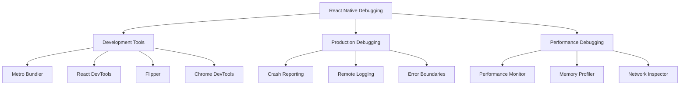

# Debugging

Comprehensive guide to debugging React Native applications using modern tools and techniques.

## Debugging Tools Overview



## Development Environment Debugging

### Metro Bundler

```bash
# Start with debugging options
npx react-native start --reset-cache

# Enable verbose logging
DEBUG=metro* npx react-native start

# Custom Metro configuration
# Metro.config.js
module.exports = {
resolver: {
    sourceExts: ['js', 'jsx', 'ts', 'tsx', 'json'],
  },
transformer: {
    getTransformOptions: async () => ({
      transform: {
        experimentalImportSupport: false,
        inlineRequires: true,
      },
    }),
  },
};
```

### React DevTools

```bash
# Install React DevTools
npm install -g react-devtools

# Start React DevTools
react-devtools

# In your app, enable DevTools
import { connectToDevTools } from 'react-devtools-core';

if (__DEV__) {
connectToDevTools({
    host: 'localhost',
    port: 8097,
  });
}
```

### Chrome DevTools Integration

```typescript
// Enable Chrome debugging
// In development, shake device or press Cmd+D (iOS) / Cmd+M (Android)
// Select "Debug with Chrome"

// Console logging with context
console.log('User action:', { userId, action, timestamp: Date.now() });

// Network debugging
fetch('https://api.example.com/users')
  .then(response => {
    console.log('Response status:', response.status);
    return response.json();
  })
  .then(data => console.log('Response data:', data))
  .catch(error => console.error('Network error:', error));

// Performance timing
console.time('expensive-operation');
performExpensiveOperation();
console.timeEnd('expensive-operation');
```

## Flipper Integration

### Setup

```bash
# Install Flipper desktop app
# Download from https://fbflipper.com/

# For React Native 0.62+, Flipper is included by default
# For older versions, install manually:
npm install --save-dev react-native-flipper
```

### Custom Flipper Plugins

```typescript
// utils/flipperLogger.ts
import { logger } from 'react-native-logs';

const flipperTransport = logger.createFlipperTransport();

export const log = logger.createLogger({
  severity: __DEV__ ? 'debug' : 'error',
  transport: __DEV__ ? [flipperTransport] : [],
});

// Usage throughout app
log.debug('User logged in', { userId: user.id });
log.error('API call failed', { endpoint, error });
```

### Network Debugging with Flipper

```typescript
// Network interceptor for Flipper
import { NetworkingModule } from 'react-native';

if (__DEV__) {
  const originalFetch = global.fetch;
  global.fetch = function (url, options) {
    console.log('Fetch request:', { url, options });

    return originalFetch(url, options)
      .then(response => {
        console.log('Fetch response:', {
          url,
          status: response.status,
          headers: response.headers,
        });
        return response;
      })
      .catch(error => {
        console.error('Fetch error:', { url, error });
        throw error;
      });
  };
}
```

## Error Handling and Logging

### Error Boundaries

```typescript
// components/ErrorBoundary.tsx
interface ErrorBoundaryState {
  hasError: boolean;
  error?: Error;
  errorInfo?: React.ErrorInfo;
}

export class ErrorBoundary extends React.Component<
React.PropsWithChildren<{}>,
ErrorBoundaryState
> {
  constructor(props: React.PropsWithChildren<{}>) {
    super(props);
    this.state = { hasError: false };
  }

  static getDerivedStateFromError(error: Error): ErrorBoundaryState {
    return { hasError: true, error };
  }

  componentDidCatch(error: Error, errorInfo: React.ErrorInfo) {
    this.setState({ errorInfo });

// Log to crash reporting service
    crashlytics().recordError(error);

// Log detailed error info
    console.error('Error Boundary caught an error:', {
      error: error.message,
      stack: error.stack,
      componentStack: errorInfo.componentStack,
    });
  }

  render() {
    if (this.state.hasError) {
      return (
        <View className="flex-1 items-center justify-center p-4">
          <Text className="text-lg font-semibold mb-2">
            Something went wrong
          </Text>
          <Text className="text-gray-600 text-center mb-4">
            {this.state.error?.message}
          </Text>
          <Button onPress={() => this.setState({ hasError: false })}>
            Try Again
          </Button>
        </View>
      );
    }

    return this.props.children;
  }
}
```

### Global Error Handler

```typescript
// utils/errorHandler.ts
import { ErrorUtils } from 'react-native';

const originalHandler = ErrorUtils.getGlobalHandler();

const globalErrorHandler = (error: any, isFatal: boolean) => {
  console.error('Global error handler:', {
    error: error.message,
    stack: error.stack,
    isFatal,
  });

  // Log to crash reporting
  crashlytics().recordError(error);

  // Call original handler
  originalHandler(error, isFatal);
};

ErrorUtils.setGlobalHandler(globalErrorHandler);

// Promise rejection handler
const rejectionHandler = (id: string, error: Error) => {
  console.error('Unhandled promise rejection:', {
    id,
    error: error.message,
    stack: error.stack,
  });

  crashlytics().recordError(error);
};

require('promise/setimmediate/rejection-tracking').enable({
  allRejections: true,
  onUnhandled: rejectionHandler,
});
```

### Custom Logging System

```typescript
// utils/logger.ts
enum LogLevel {
  DEBUG = 0,
  INFO = 1,
  WARN = 2,
  ERROR = 3,
}

interface LogEntry {
  level: LogLevel;
  message: string;
  data?: any;
  timestamp: number;
  userId?: string;
  sessionId: string;
}

class Logger {
  private logs: LogEntry[] = [];
  private sessionId = Math.random().toString(36);
  private userId?: string;

  setUserId(userId: string) {
    this.userId = userId;
  }

  private log(level: LogLevel, message: string, data?: any) {
    const entry: LogEntry = {
      level,
      message,
      data,
      timestamp: Date.now(),
      userId: this.userId,
      sessionId: this.sessionId,
    };

    this.logs.push(entry);

    // Keep only last 1000 logs
    if (this.logs.length > 1000) {
      this.logs = this.logs.slice(-1000);
    }

    // Console output in development
    if (__DEV__) {
      const levelName = LogLevel[level];
      console.log(`[${levelName}] ${message}`, data || '');
    }

    // Send to remote logging service in production
    if (!__DEV__ && level >= LogLevel.ERROR) {
      this.sendToRemoteLogger(entry);
    }
  }

  debug(message: string, data?: any) {
    this.log(LogLevel.DEBUG, message, data);
  }

  info(message: string, data?: any) {
    this.log(LogLevel.INFO, message, data);
  }

  warn(message: string, data?: any) {
    this.log(LogLevel.WARN, message, data);
  }

  error(message: string, data?: any) {
    this.log(LogLevel.ERROR, message, data);
  }

  getLogs() {
    return this.logs;
  }

  private async sendToRemoteLogger(entry: LogEntry) {
    try {
      await fetch('https://api.yourapp.com/logs', {
        method: 'POST',
        headers: { 'Content-Type': 'application/json' },
        body: JSON.stringify(entry),
      });
    } catch (error) {
      // Fail silently to avoid infinite loops
    }
  }
}

export const logger = new Logger();
```

## Performance Debugging

### Performance Monitor

```typescript
// utils/performanceMonitor.ts
class PerformanceMonitor {
  private measurements: Map<string, number> = new Map();

  start(label: string) {
    this.measurements.set(label, performance.now());
  }

  end(label: string) {
    const startTime = this.measurements.get(label);
    if (startTime) {
      const duration = performance.now() - startTime;
      console.log(`Performance [${label}]: ${duration.toFixed(2)}ms`);
      this.measurements.delete(label);
      return duration;
    }
    return 0;
  }

  measure<T>(label: string, fn: () => T): T {
    this.start(label);
    const result = fn();
    this.end(label);
    return result;
  }

  async measureAsync<T>(label: string, fn: () => Promise<T>): Promise<T> {
    this.start(label);
    try {
      const result = await fn();
      this.end(label);
      return result;
    } catch (error) {
      this.end(label);
      throw error;
    }
  }
}

export const perf = new PerformanceMonitor();

// Usage
perf.start('api-call');
const data = await fetchUserData();
perf.end('api-call');

// Or with wrapper
const data = await perf.measureAsync('api-call', () => fetchUserData());
```

### Memory Debugging

```typescript
// utils/memoryMonitor.ts
import { DeviceInfo } from 'react-native';

class MemoryMonitor {
  private interval?: NodeJS.Timeout;

  start() {
    if (__DEV__) {
      this.interval = setInterval(() => {
        this.logMemoryUsage();
      }, 5000);
    }
  }

  stop() {
    if (this.interval) {
      clearInterval(this.interval);
    }
  }

  private async logMemoryUsage() {
    try {
      const memoryInfo = await DeviceInfo.getUsedMemory();
      const totalMemory = await DeviceInfo.getTotalMemory();
      const usagePercent = (memoryInfo / totalMemory) * 100;

      console.log('Memory Usage:', {
        used: `${(memoryInfo / 1024 / 1024).toFixed(2)} MB`,
        total: `${(totalMemory / 1024 / 1024).toFixed(2)} MB`,
        percentage: `${usagePercent.toFixed(1)}%`,
      });

      if (usagePercent > 80) {
        console.warn('High memory usage detected!');
      }
    } catch (error) {
      console.error('Failed to get memory info:', error);
    }
  }
}

export const memoryMonitor = new MemoryMonitor();
```

## Network Debugging

### Request/Response Interceptor

```typescript
// utils/networkDebugger.ts
interface NetworkRequest {
  id: string;
  url: string;
  method: string;
  headers: Record<string, string>;
  body?: any;
  timestamp: number;
}

interface NetworkResponse {
  id: string;
  status: number;
  headers: Record<string, string>;
  body?: any;
  duration: number;
}

class NetworkDebugger {
  private requests: Map<string, NetworkRequest> = new Map();
  private responses: NetworkResponse[] = [];

  interceptFetch() {
    const originalFetch = global.fetch;

    global.fetch = async (url: string, options: RequestInit = {}) => {
      const id = Math.random().toString(36);
      const request: NetworkRequest = {
        id,
        url,
        method: options.method || 'GET',
        headers: (options.headers as Record<string, string>) || {},
        body: options.body,
        timestamp: Date.now(),
      };

      this.requests.set(id, request);
      console.log('Network Request:', request);

      try {
        const response = await originalFetch(url, options);
        const duration = Date.now() - request.timestamp;

        const responseData: NetworkResponse = {
          id,
          status: response.status,
          headers: Object.fromEntries(response.headers.entries()),
          duration,
        };

        // Clone response to read body without consuming it
        const clonedResponse = response.clone();
        try {
          responseData.body = await clonedResponse.text();
        } catch (error) {
          // Body might not be readable
        }

        this.responses.push(responseData);
        console.log('Network Response:', responseData);

        return response;
      } catch (error) {
        const duration = Date.now() - request.timestamp;
        console.error('Network Error:', { id, error, duration });
        throw error;
      } finally {
        this.requests.delete(id);
      }
    };
  }

  getNetworkHistory() {
    return this.responses;
  }

  clearHistory() {
    this.responses = [];
  }
}

export const networkDebugger = new NetworkDebugger();

// Initialize in development
if (__DEV__) {
  networkDebugger.interceptFetch();
}
```

## Debugging Hooks

### Custom Debug Hooks

```typescript
// hooks/useDebug.ts
export function useDebug(value: any, label?: string) {
  const ref = useRef(value);

  useEffect(() => {
    if (ref.current !== value) {
      console.log(`Debug ${label || 'value'} changed:`, {
        from: ref.current,
        to: value,
      });
      ref.current = value;
    }
  });
}

// hooks/useWhyDidYouUpdate.ts
export function useWhyDidYouUpdate(name: string, props: Record<string, any>) {
  const previousProps = useRef<Record<string, any>>();

  useEffect(() => {
    if (previousProps.current) {
      const allKeys = Object.keys({ ...previousProps.current, ...props });
      const changedProps: Record<string, any> = {};

      allKeys.forEach(key => {
        if (previousProps.current![key] !== props[key]) {
          changedProps[key] = {
            from: previousProps.current![key],
            to: props[key],
          };
        }
      });

      if (Object.keys(changedProps).length) {
        console.log('[why-did-you-update]', name, changedProps);
      }
    }

    previousProps.current = props;
  });
}

// Usage
function MyComponent({ userId, data }) {
  useDebug(userId, 'userId');
  useWhyDidYouUpdate('MyComponent', { userId, data });

  return <View>...</View>;
}
```

## Production Debugging

### Remote Debugging Setup

```typescript
// utils/remoteDebugger.ts
class RemoteDebugger {
  private endpoint: string;
  private apiKey: string;

  constructor(endpoint: string, apiKey: string) {
    this.endpoint = endpoint;
    this.apiKey = apiKey;
  }

  async sendLog(level: string, message: string, data?: any) {
    if (__DEV__) return;

    try {
      await fetch(`${this.endpoint}/logs`, {
        method: 'POST',
        headers: {
          'Content-Type': 'application/json',
          Authorization: `Bearer ${this.apiKey}`,
        },
        body: JSON.stringify({
          level,
          message,
          data,
          timestamp: Date.now(),
          platform: Platform.OS,
          version: DeviceInfo.getVersion(),
        }),
      });
    } catch (error) {
      // Fail silently
    }
  }

  async sendCrash(error: Error, isFatal: boolean) {
    await this.sendLog('error', 'App crash', {
      message: error.message,
      stack: error.stack,
      isFatal,
    });
  }
}

export const remoteDebugger = new RemoteDebugger(
  process.env.EXPO_PUBLIC_DEBUG_ENDPOINT!,
  process.env.EXPO_PUBLIC_DEBUG_API_KEY!
);
```

## Best Practices

### 1. Conditional Debugging

```typescript
// Only enable debugging features in development
const DEBUG_FEATURES = {
  networkLogging: __DEV__,
  performanceMonitoring: __DEV__,
  memoryTracking: __DEV__,
  verboseLogging: __DEV__,
};

if (DEBUG_FEATURES.networkLogging) {
  networkDebugger.interceptFetch();
}
```

### 2. Debug Menu

```typescript
// components/DebugMenu.tsx (development only)
export function DebugMenu() {
  if (!__DEV__) return null;

  return (
    <View className="absolute top-10 right-4 bg-black/80 p-2 rounded">
      <Button onPress={() => logger.getLogs()}>View Logs</Button>
      <Button onPress={() => networkDebugger.getNetworkHistory()}>
        Network History
      </Button>
      <Button onPress={() => memoryMonitor.logMemoryUsage()}>
        Memory Usage
      </Button>
    </View>
  );
}
```

### 3. Environment-Specific Debugging

```typescript
// Different debug levels for different environments
const DEBUG_LEVEL = {
  development: 'debug',
  staging: 'info',
  production: 'error',
}[process.env.NODE_ENV || 'development'];
```

## Next Steps

1. Set up your debugging environment with the appropriate tools
2. Implement error boundaries and global error handling
3. Add performance monitoring for critical app flows
4. Set up remote logging for production debugging
5. Create debugging utilities specific to your app's needs

---

**Pro Tip**: Invest time in setting up comprehensive debugging tools early in development. Good debugging infrastructure pays dividends throughout the entire development lifecycle.
