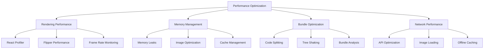

# Performance Optimization

Comprehensive guide to optimizing React Native application performance for smooth user experiences across all devices.

## Performance Monitoring



## React Performance Optimization

### Component Optimization

```typescript
// Use React.memo for expensive components
const UserCard = React.memo(({ user, onPress }) => {
  return (
    <Pressable onPress={() => onPress(user.id)}>
      <Text>{user.name}</Text>
      <Text>{user.email}</Text>
    </Pressable>
  );
}, (prevProps, nextProps) => {
  // Custom comparison function
  return (
    prevProps.user.id === nextProps.user.id &&
    prevProps.user.name === nextProps.user.name &&
    prevProps.user.email === nextProps.user.email
  );
});

// Use useMemo for expensive calculations
const ExpensiveComponent = ({ data }) => {
  const processedData = useMemo(() => {
    return data
      .filter(item => item.active)
      .map(item => ({
        ...item,
        displayName: `${item.firstName} ${item.lastName}`,
        score: calculateComplexScore(item),
      }))
      .sort((a, b) => b.score - a.score);
  }, [data]);

  return (
    <FlatList
      data={processedData}
      renderItem={({ item }) => <UserCard user={item} />}
      keyExtractor={item => item.id}
    />
  );
};

// Use useCallback for event handlers
const ListComponent = ({ items, onItemPress }) => {
  const handleItemPress = useCallback((itemId) => {
    onItemPress?.(itemId);
  }, [onItemPress]);

  const renderItem = useCallback(({ item }) => (
    <UserCard user={item} onPress={handleItemPress} />
  ), [handleItemPress]);

  return (
    <FlatList
      data={items}
      renderItem={renderItem}
      keyExtractor={item => item.id}
      removeClippedSubviews={true}
      maxToRenderPerBatch={10}
      windowSize={10}
    />
  );
};
```

### List Performance

```typescript
// Optimized FlatList configuration
const OptimizedList = ({ data }) => {
  const renderItem = useCallback(({ item, index }) => (
    <ListItem item={item} index={index} />
  ), []);

  const getItemLayout = useCallback((data, index) => ({
    length: ITEM_HEIGHT,
    offset: ITEM_HEIGHT * index,
    index,
  }), []);

  const keyExtractor = useCallback((item) => item.id, []);

  return (
    <FlatList
      data={data}
      renderItem={renderItem}
      keyExtractor={keyExtractor}
      getItemLayout={getItemLayout}
      removeClippedSubviews={true}
      maxToRenderPerBatch={10}
      updateCellsBatchingPeriod={50}
      initialNumToRender={10}
      windowSize={10}
      legacyImplementation={false}
    />
  );
};

// Virtual list for very large datasets
import { VirtualizedList } from 'react-native';

const VirtualList = ({ data }) => {
  const getItem = (data, index) => data[index];
  const getItemCount = (data) => data.length;

  return (
    <VirtualizedList
      data={data}
      initialNumToRender={4}
      renderItem={({ item }) => <ListItem item={item} />}
      keyExtractor={(item) => item.id}
      getItemCount={getItemCount}
      getItem={getItem}
      maxToRenderPerBatch={5}
      updateCellsBatchingPeriod={30}
      windowSize={10}
    />
  );
};
```

## Image Optimization

### Image Loading Strategies

```typescript
// Optimized image component
import FastImage from 'react-native-fast-image';

const OptimizedImage = ({ source, style, ...props }) => {
  return (
    <FastImage
      source={{
        uri: source.uri,
        priority: FastImage.priority.normal,
        cache: FastImage.cacheControl.immutable,
      }}
      style={style}
      resizeMode={FastImage.resizeMode.cover}
      {...props}
    />
  );
};

// Progressive image loading
const ProgressiveImage = ({ source, placeholder, style }) => {
  const [imageLoaded, setImageLoaded] = useState(false);
  const [imageError, setImageError] = useState(false);

  return (
    <View style={style}>
      {!imageLoaded && !imageError && (
        <Image
          source={placeholder}
          style={[style, { position: 'absolute' }]}
          blurRadius={1}
        />
      )}
      <FastImage
        source={source}
        style={style}
        onLoad={() => setImageLoaded(true)}
        onError={() => setImageError(true)}
      />
    </View>
  );
};

// Image caching utility
class ImageCache {
  private cache = new Map<string, string>();

  async getImage(url: string): Promise<string> {
    if (this.cache.has(url)) {
      return this.cache.get(url)!;
    }

    try {
      const response = await fetch(url);
      const blob = await response.blob();
      const base64 = await this.blobToBase64(blob);

      this.cache.set(url, base64);
      return base64;
    } catch (error) {
      throw new Error(`Failed to cache image: ${url}`);
    }
  }

  private blobToBase64(blob: Blob): Promise<string> {
    return new Promise((resolve, reject) => {
      const reader = new FileReader();
      reader.onload = () => resolve(reader.result as string);
      reader.onerror = reject;
      reader.readAsDataURL(blob);
    });
  }

  clearCache() {
    this.cache.clear();
  }

  getCacheSize() {
    return this.cache.size;
  }
}
```

## Memory Management

### Memory Leak Prevention

```typescript
// Proper cleanup in useEffect
const ComponentWithCleanup = () => {
  useEffect(() => {
    const subscription = eventEmitter.addListener('event', handleEvent);
    const timer = setInterval(updateData, 1000);

    return () => {
      subscription.remove();
      clearInterval(timer);
    };
  }, []);

  // Cleanup async operations
  useEffect(() => {
    let isMounted = true;

    const fetchData = async () => {
      try {
        const data = await apiCall();
        if (isMounted) {
          setData(data);
        }
      } catch (error) {
        if (isMounted) {
          setError(error);
        }
      }
    };

    fetchData();

    return () => {
      isMounted = false;
    };
  }, []);
};

// Memory monitoring hook
const useMemoryMonitor = () => {
  useEffect(() => {
    const checkMemory = () => {
      if (__DEV__) {
        const memoryInfo = performance.memory;
        console.log('Memory Usage:', {
          used: `${(memoryInfo.usedJSHeapSize / 1024 / 1024).toFixed(2)} MB`,
          total: `${(memoryInfo.totalJSHeapSize / 1024 / 1024).toFixed(2)} MB`,
          limit: `${(memoryInfo.jsHeapSizeLimit / 1024 / 1024).toFixed(2)} MB`,
        });
      }
    };

    const interval = setInterval(checkMemory, 5000);
    return () => clearInterval(interval);
  }, []);
};
```

### Efficient State Management

```typescript
// Use state selectors to prevent unnecessary re-renders
const useUserProfile = (userId: string) => {
  return useSelector((state: RootState) => state.users.find(user => user.id === userId));
};

// Better: Use memoized selectors
const makeSelectUserById = () =>
  createSelector(
    [(state: RootState) => state.users, (state: RootState, userId: string) => userId],
    (users, userId) => users.find(user => user.id === userId)
  );

// Normalize state structure
interface NormalizedState {
  users: {
    byId: Record<string, User>;
    allIds: string[];
  };
  posts: {
    byId: Record<string, Post>;
    allIds: string[];
  };
}

// Use immer for immutable updates
import { produce } from 'immer';

const userReducer = (state = initialState, action) => {
  return produce(state, draft => {
    switch (action.type) {
      case 'UPDATE_USER':
        const user = draft.users.byId[action.payload.id];
        if (user) {
          Object.assign(user, action.payload.updates);
        }
        break;
    }
  });
};
```

## Bundle Optimization

### Code Splitting

```typescript
// Lazy load screens
const ProfileScreen = lazy(() => import('./screens/ProfileScreen'));
const SettingsScreen = lazy(() => import('./screens/SettingsScreen'));

// Lazy load heavy components
const ChartComponent = lazy(() => import('./components/Chart'));

const Dashboard = () => {
  const [showChart, setShowChart] = useState(false);

  return (
    <View>
      <Button onPress={() => setShowChart(true)}>Show Chart</Button>
      {showChart && (
        <Suspense fallback={<LoadingSpinner />}>
          <ChartComponent />
        </Suspense>
      )}
    </View>
  );
};

// Dynamic imports for utilities
const loadHeavyUtility = async () => {
  const { heavyFunction } = await import('./utils/heavyUtility');
  return heavyFunction;
};
```

### Bundle Analysis

```bash
# Analyze bundle size
npx react-native bundle --platform android --dev false --entry-file index.js --bundle-output android-bundle.js
npx react-native-bundle-visualizer

# Metro bundle analyzer
npm install --save-dev metro-visualizer
npx metro-visualizer
```

```javascript
// metro.config.js - Optimization settings
module.exports = {
  transformer: {
    minifierConfig: {
      mangle: {
        keep_fnames: true,
      },
      output: {
        ascii_only: true,
        quote_style: 3,
        wrap_iife: true,
      },
      sourceMap: {
        includeSources: false,
      },
      toplevel: false,
      warnings: false,
    },
  },
  resolver: {
    alias: {
      '@': './src',
    },
  },
};
```

## Network Performance

### API Optimization

```typescript
// Request deduplication
class RequestDeduplicator {
  private pendingRequests = new Map<string, Promise<any>>();

  async request<T>(key: string, requestFn: () => Promise<T>): Promise<T> {
    if (this.pendingRequests.has(key)) {
      return this.pendingRequests.get(key);
    }

    const promise = requestFn().finally(() => {
      this.pendingRequests.delete(key);
    });

    this.pendingRequests.set(key, promise);
    return promise;
  }
}

// Request batching
class RequestBatcher {
  private batch: Array<{ id: string; resolve: Function; reject: Function }> = [];
  private timer: NodeJS.Timeout | null = null;

  add<T>(id: string): Promise<T> {
    return new Promise((resolve, reject) => {
      this.batch.push({ id, resolve, reject });

      if (!this.timer) {
        this.timer = setTimeout(() => this.flush(), 50);
      }
    });
  }

  private async flush() {
    const currentBatch = [...this.batch];
    this.batch = [];
    this.timer = null;

    try {
      const ids = currentBatch.map(item => item.id);
      const results = await this.batchRequest(ids);

      currentBatch.forEach((item, index) => {
        item.resolve(results[index]);
      });
    } catch (error) {
      currentBatch.forEach(item => {
        item.reject(error);
      });
    }
  }

  private async batchRequest(ids: string[]) {
    const response = await fetch('/api/batch', {
      method: 'POST',
      body: JSON.stringify({ ids }),
    });
    return response.json();
  }
}

// Optimistic updates with rollback
const useOptimisticUpdate = () => {
  const queryClient = useQueryClient();

  return useMutation({
    mutationFn: updateUser,
    onMutate: async newUser => {
      await queryClient.cancelQueries(['user', newUser.id]);
      const previousUser = queryClient.getQueryData(['user', newUser.id]);
      queryClient.setQueryData(['user', newUser.id], newUser);
      return { previousUser };
    },
    onError: (err, newUser, context) => {
      queryClient.setQueryData(['user', newUser.id], context?.previousUser);
    },
    onSettled: () => {
      queryClient.invalidateQueries(['user']);
    },
  });
};
```

### Caching Strategies

```typescript
// Multi-level caching
class CacheManager {
  private memoryCache = new Map<string, { data: any; expiry: number }>();
  private diskCache: AsyncStorage;

  constructor() {
    this.diskCache = AsyncStorage;
  }

  async get<T>(key: string): Promise<T | null> {
    // Check memory cache first
    const memoryItem = this.memoryCache.get(key);
    if (memoryItem && memoryItem.expiry > Date.now()) {
      return memoryItem.data;
    }

    // Check disk cache
    try {
      const diskItem = await this.diskCache.getItem(key);
      if (diskItem) {
        const parsed = JSON.parse(diskItem);
        if (parsed.expiry > Date.now()) {
          // Restore to memory cache
          this.memoryCache.set(key, parsed);
          return parsed.data;
        }
      }
    } catch (error) {
      console.warn('Disk cache read error:', error);
    }

    return null;
  }

  async set<T>(key: string, data: T, ttl: number = 300000): Promise<void> {
    const expiry = Date.now() + ttl;
    const item = { data, expiry };

    // Set in memory cache
    this.memoryCache.set(key, item);

    // Set in disk cache
    try {
      await this.diskCache.setItem(key, JSON.stringify(item));
    } catch (error) {
      console.warn('Disk cache write error:', error);
    }
  }

  clear(): void {
    this.memoryCache.clear();
    this.diskCache.clear();
  }
}
```

## Performance Monitoring

### Custom Performance Hooks

```typescript
// Performance measurement hook
const usePerformanceMonitor = (label: string) => {
  const startTime = useRef<number>();

  const start = useCallback(() => {
    startTime.current = performance.now();
  }, []);

  const end = useCallback(() => {
    if (startTime.current) {
      const duration = performance.now() - startTime.current;
      console.log(`Performance [${label}]: ${duration.toFixed(2)}ms`);

      // Send to analytics
      analytics.track('performance_metric', {
        label,
        duration,
        timestamp: Date.now(),
      });

      startTime.current = undefined;
      return duration;
    }
    return 0;
  }, [label]);

  return { start, end };
};

// Frame rate monitor
const useFrameRateMonitor = () => {
  const [frameRate, setFrameRate] = useState(60);

  useEffect(() => {
    let frameCount = 0;
    let lastTime = performance.now();

    const measureFrameRate = () => {
      frameCount++;
      const currentTime = performance.now();

      if (currentTime - lastTime >= 1000) {
        setFrameRate(frameCount);
        frameCount = 0;
        lastTime = currentTime;
      }

      requestAnimationFrame(measureFrameRate);
    };

    const animationId = requestAnimationFrame(measureFrameRate);

    return () => cancelAnimationFrame(animationId);
  }, []);

  return frameRate;
};
```

### Performance Profiling

```typescript
// React Profiler integration
const ProfiledComponent = ({ children, id }) => {
  const onRenderCallback = (id, phase, actualDuration, baseDuration, startTime, commitTime) => {
    console.log('Profiler:', {
      id,
      phase,
      actualDuration,
      baseDuration,
      startTime,
      commitTime,
    });

    // Send to analytics if duration is concerning
    if (actualDuration > 16) { // More than one frame at 60fps
      analytics.track('slow_render', {
        componentId: id,
        duration: actualDuration,
        phase,
      });
    }
  };

  return (
    <Profiler id={id} onRender={onRenderCallback}>
      {children}
    </Profiler>
  );
};

// Custom performance observer
class PerformanceObserver {
  private observers: Array<(entry: any) => void> = [];

  observe(callback: (entry: any) => void) {
    this.observers.push(callback);
  }

  measure(name: string, startMark: string, endMark: string) {
    performance.mark(startMark);
    // ... operation
    performance.mark(endMark);
    performance.measure(name, startMark, endMark);

    const entries = performance.getEntriesByName(name);
    const entry = entries[entries.length - 1];

    this.observers.forEach(callback => callback(entry));
  }
}
```

## Platform-Specific Optimizations

### iOS Optimizations

```typescript
// iOS-specific optimizations
import { Platform } from 'react-native';

const IOSOptimizedComponent = () => {
  return (
    <ScrollView
      {...(Platform.OS === 'ios' && {
        bounces: false,
        showsVerticalScrollIndicator: false,
        decelerationRate: 'fast',
      })}
      >
      {/* Content */}
    </ScrollView>
  );
};

// Use native driver for animations
const animatedValue = useRef(new Animated.Value(0)).current;

const animate = () => {
  Animated.timing(animatedValue, {
    toValue: 1,
    duration: 300,
    useNativeDriver: true, // Important for performance
  }).start();
};
```

### Android Optimizations

```typescript
// Android-specific optimizations
const AndroidOptimizedList = ({ data }) => {
  return (
    <FlatList
      data={data}
      renderItem={renderItem}
      {...(Platform.OS === 'android' && {
        removeClippedSubviews: true,
        maxToRenderPerBatch: 5,
        updateCellsBatchingPeriod: 30,
        getItemLayout: getItemLayout,
      })}
    />
  );
};

// Handle Android back button efficiently
useEffect(() => {
  if (Platform.OS === 'android') {
    const backHandler = BackHandler.addEventListener('hardwareBackPress', () => {
      // Handle back press efficiently
      return true; // Prevent default behavior
    });

    return () => backHandler.remove();
  }
}, []);
```

## Best Practices

### 1. Measure Before Optimizing

```typescript
// Always measure performance before and after optimizations
const measurePerformance = (fn: Function, label: string) => {
  const start = performance.now();
  const result = fn();
  const end = performance.now();
  console.log(`${label}: ${end - start}ms`);
  return result;
};
```

### 2. Use Production Builds for Testing

```bash
# Always test performance with production builds
npx react-native run-android --variant=release
npx react-native run-ios --configuration Release
```

### 3. Monitor Real-World Performance

```typescript
// Track performance metrics in production
const trackPerformanceMetric = (metric: string, value: number) => {
  if (!__DEV__) {
    analytics.track('performance_metric', {
      metric,
      value,
      platform: Platform.OS,
      version: DeviceInfo.getVersion(),
    });
  }
};
```

## Next Steps

1. Set up performance monitoring tools and baselines
2. Optimize critical rendering paths and heavy components
3. Implement efficient image loading and caching strategies
4. Optimize bundle size through code splitting and tree shaking
5. Monitor and optimize network requests and API calls
6. Continuously measure and improve performance metrics

---

**Pro Tip**: Performance optimization is an ongoing process. Start with the biggest impact optimizations (list performance, image loading, bundle size) and continuously monitor real-world performance metrics to identify areas for improvement.
