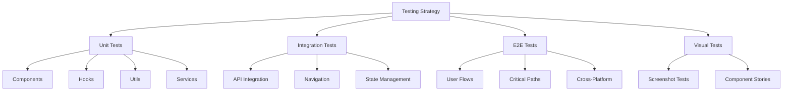

# Testing

Comprehensive testing strategies for React Native applications covering unit tests, integration tests, and end-to-end testing.

## Testing Strategy Overview



## Testing Pyramid

| Test Type             | Coverage | Speed  | Cost   | Confidence |
| --------------------- | -------- | ------ | ------ | ---------- |
| **Unit Tests**        | 70%      | Fast   | Low    | Medium     |
| **Integration Tests** | 20%      | Medium | Medium | High       |
| **E2E Tests**         | 10%      | Slow   | High   | Very High  |

## Unit Testing with Jest

### Setup

```bash
npm install --save-dev jest @testing-library/react-native @testing-library/jest-native
```

```javascript
// jest.config.js
module.exports = {
  preset: 'react-native',
  setupFilesAfterEnv: ['<rootDir>/jest-setup.js'],
  transformIgnorePatterns: [
    'node_modules/(?!(react-native|@react-native|react-native-vector-icons)/)',
  ],
  collectCoverageFrom: [
    'src/**/*.{js,jsx,ts,tsx}',
    '!src/**/*.d.ts',
    '!src/**/*.stories.{js,jsx,ts,tsx}',
  ],
  coverageThreshold: {
    global: {
      branches: 80,
      functions: 80,
      lines: 80,
      statements: 80,
    },
  },
};

// jest-setup.js
import '@testing-library/jest-native/extend-expect';
import 'react-native-gesture-handler/jestSetup';

jest.mock('react-native-reanimated', () => {
  const Reanimated = require('react-native-reanimated/mock');
  Reanimated.default.call = () => {};
  return Reanimated;
});
```

### Component Testing

```typescript
// __tests__/Button.test.tsx
import React from 'react';
import { render, fireEvent } from '@testing-library/react-native';
import { Button } from '../components/Button';

describe('Button', () => {
  it('renders correctly', () => {
    const { getByText } = render(<Button>Click me</Button>);
    expect(getByText('Click me')).toBeTruthy();
  });

  it('calls onPress when pressed', () => {
    const onPress = jest.fn();
    const { getByText } = render(
      <Button onPress={onPress}>Click me</Button>
    );

    fireEvent.press(getByText('Click me'));
    expect(onPress).toHaveBeenCalledTimes(1);
  });

  it('shows loading state', () => {
    const { getByTestId } = render(
      <Button loading testID="button">Loading</Button>
    );

    expect(getByTestId('button')).toHaveStyle({ opacity: 0.5 });
  });

  it('applies correct variant styles', () => {
    const { getByTestId } = render(
      <Button variant="secondary" testID="button">Secondary</Button>
    );

    expect(getByTestId('button')).toHaveClass('bg-gray-200');
  });
});
```

### Hook Testing

```typescript
// __tests__/useAuth.test.ts
import { renderHook, act } from '@testing-library/react-native';
import { useAuth } from '../hooks/useAuth';

const mockAuthService = {
  login: jest.fn(),
  logout: jest.fn(),
  getCurrentUser: jest.fn(),
};

jest.mock('../services/authService', () => mockAuthService);

describe('useAuth', () => {
  beforeEach(() => {
    jest.clearAllMocks();
  });

  it('should login user successfully', async () => {
    const mockUser = { id: '1', email: 'test@example.com' };
    mockAuthService.login.mockResolvedValue(mockUser);

    const { result } = renderHook(() => useAuth());

    await act(async () => {
      await result.current.login('test@example.com', 'password');
    });

    expect(result.current.user).toEqual(mockUser);
    expect(result.current.isAuthenticated).toBe(true);
  });

  it('should handle login error', async () => {
    const error = new Error('Invalid credentials');
    mockAuthService.login.mockRejectedValue(error);

    const { result } = renderHook(() => useAuth());

    await act(async () => {
      try {
        await result.current.login('test@example.com', 'wrong-password');
      } catch (e) {
        // Expected error
      }
    });

    expect(result.current.user).toBeNull();
    expect(result.current.isAuthenticated).toBe(false);
  });
});
```

### Service Testing

```typescript
// __tests__/userService.test.ts
import { userService } from '../services/userService';

// Mock fetch
global.fetch = jest.fn();

describe('userService', () => {
  beforeEach(() => {
    (fetch as jest.Mock).mockClear();
  });

  it('should fetch user by id', async () => {
    const mockUser = { id: '1', name: 'John Doe' };
    (fetch as jest.Mock).mockResolvedValue({
      ok: true,
      json: () => Promise.resolve(mockUser),
    });

    const user = await userService.getUser('1');

    expect(fetch).toHaveBeenCalledWith('/api/users/1');
    expect(user).toEqual(mockUser);
  });

  it('should handle API errors', async () => {
    (fetch as jest.Mock).mockResolvedValue({
      ok: false,
      status: 404,
    });

    await expect(userService.getUser('999')).rejects.toThrow('User not found');
  });
});
```

## Integration Testing

### Navigation Testing

```typescript
// __tests__/navigation.test.tsx
import React from 'react';
import { NavigationContainer } from '@react-navigation/native';
import { render, fireEvent } from '@testing-library/react-native';
import { createNativeStackNavigator } from '@react-navigation/native-stack';
import { HomeScreen } from '../screens/HomeScreen';
import { ProfileScreen } from '../screens/ProfileScreen';

const Stack = createNativeStackNavigator();

function TestNavigator() {
  return (
    <NavigationContainer>
      <Stack.Navigator>
        <Stack.Screen name="Home" component={HomeScreen} />
        <Stack.Screen name="Profile" component={ProfileScreen} />
      </Stack.Navigator>
    </NavigationContainer>
  );
}

describe('Navigation', () => {
  it('navigates to profile screen', async () => {
    const { getByText, findByText } = render(<TestNavigator />);

    fireEvent.press(getByText('Go to Profile'));

    await findByText('Profile Screen');
  });
});
```

### State Management Testing

```typescript
// __tests__/store.test.ts
import { renderHook, act } from '@testing-library/react-native';
import { useUserStore } from '../store/userStore';

describe('userStore', () => {
  beforeEach(() => {
    useUserStore.getState().reset();
  });

  it('should add user to store', () => {
    const { result } = renderHook(() => useUserStore());
    const user = { id: '1', name: 'John' };

    act(() => {
      result.current.addUser(user);
    });

    expect(result.current.users).toContain(user);
  });

  it('should remove user from store', () => {
    const { result } = renderHook(() => useUserStore());
    const user = { id: '1', name: 'John' };

    act(() => {
      result.current.addUser(user);
      result.current.removeUser('1');
    });

    expect(result.current.users).not.toContain(user);
  });
});
```

## End-to-End Testing

### Detox Setup

```bash
npm install --save-dev detox
npx detox init
```

```javascript
// .detoxrc.js
module.exports = {
  testRunner: 'jest',
  runnerConfig: 'e2e/jest.config.js',
  configurations: {
    'ios.sim.debug': {
      device: 'simulator',
      app: 'ios.debug',
    },
    'android.emu.debug': {
      device: 'emulator',
      app: 'android.debug',
    },
  },
  devices: {
    simulator: {
      type: 'ios.simulator',
      device: {
        type: 'iPhone 14',
      },
    },
    emulator: {
      type: 'android.emulator',
      device: {
        avdName: 'Pixel_4_API_30',
      },
    },
  },
  apps: {
    'ios.debug': {
      type: 'ios.app',
      binaryPath: 'ios/build/Build/Products/Debug-iphonesimulator/MyApp.app',
      build:
        'xcodebuild -workspace ios/MyApp.xcworkspace -scheme MyApp -configuration Debug -sdk iphonesimulator -derivedDataPath ios/build',
    },
    'android.debug': {
      type: 'android.apk',
      binaryPath: 'android/app/build/outputs/apk/debug/app-debug.apk',
      build: 'cd android && ./gradlew assembleDebug assembleAndroidTest -DtestBuildType=debug',
    },
  },
};
```

### E2E Test Examples

```typescript
// e2e/login.e2e.ts
describe('Login Flow', () => {
  beforeAll(async () => {
    await device.launchApp();
  });

  beforeEach(async () => {
    await device.reloadReactNative();
  });

  it('should login with valid credentials', async () => {
    await element(by.id('email-input')).typeText('test@example.com');
    await element(by.id('password-input')).typeText('password123');
    await element(by.id('login-button')).tap();

    await expect(element(by.text('Welcome!'))).toBeVisible();
  });

  it('should show error for invalid credentials', async () => {
    await element(by.id('email-input')).typeText('invalid@example.com');
    await element(by.id('password-input')).typeText('wrongpassword');
    await element(by.id('login-button')).tap();

    await expect(element(by.text('Invalid credentials'))).toBeVisible();
  });

  it('should navigate through app after login', async () => {
    // Login first
    await element(by.id('email-input')).typeText('test@example.com');
    await element(by.id('password-input')).typeText('password123');
    await element(by.id('login-button')).tap();

    // Navigate to profile
    await element(by.id('profile-tab')).tap();
    await expect(element(by.text('Profile'))).toBeVisible();

    // Navigate to settings
    await element(by.id('settings-button')).tap();
    await expect(element(by.text('Settings'))).toBeVisible();
  });
});
```

### Maestro Testing (Alternative)

```yaml
# Flows/login.yaml
appId: com.yourapp.debug
    ---
  - launchApp
  - tapOn: 'Login'
  - inputText: 'test@example.com'
  - tapOn: 'Password'
  - inputText: 'password123'
  - tapOn: 'Sign In'
  - assertVisible: 'Welcome'
```

```bash
# Run Maestro tests
maestro test flows/
```

## Visual Testing

### Storybook Setup

```bash
npm install --save-dev @storybook/react-native
npx storybook init
```

```typescript
// stories/Button.stories.tsx
import type { Meta, StoryObj } from '@storybook/react';
import { Button } from '../components/Button';

const meta: Meta<typeof Button> = {
  title: 'UI/Button',
  component: Button,
  argTypes: {
    variant: {
      control: { type: 'select' },
      options: ['primary', 'secondary', 'outline'],
    },
  },
};

export default meta;
type Story = StoryObj<typeof meta>;

export const Primary: Story = {
  args: {
    children: 'Primary Button',
    variant: 'primary',
  },
};

export const Loading: Story = {
  args: {
    children: 'Loading Button',
    loading: true,
  },
};
```

### Screenshot Testing

```typescript
// __tests__/screenshots.test.tsx
import { render } from '@testing-library/react-native';
import { Button } from '../components/Button';

describe('Screenshot Tests', () => {
  it('should match button snapshot', () => {
    const { toJSON } = render(<Button>Test Button</Button>);
    expect(toJSON()).toMatchSnapshot();
  });

  it('should match loading button snapshot', () => {
    const { toJSON } = render(<Button loading>Loading</Button>);
    expect(toJSON()).toMatchSnapshot();
  });
});
```

## Test Utilities

### Custom Render Function

```typescript
// test-utils/render.tsx
import React from 'react';
import { render as rtlRender } from '@testing-library/react-native';
import { NavigationContainer } from '@react-navigation/native';
import { QueryClient, QueryClientProvider } from '@tanstack/react-query';
import { ThemeProvider } from '../contexts/ThemeContext';

interface RenderOptions {
  initialRoute?: string;
  theme?: 'light' | 'dark';
}

function render(ui: React.ReactElement, options: RenderOptions = {}) {
  const { initialRoute = '/', theme = 'light' } = options;

  const queryClient = new QueryClient({
    defaultOptions: {
      queries: { retry: false },
      mutations: { retry: false },
    },
  });

  function Wrapper({ children }: { children: React.ReactNode }) {
    return (
      <QueryClientProvider client={queryClient}>
        <ThemeProvider initialTheme={theme}>
          <NavigationContainer>
            {children}
          </NavigationContainer>
        </ThemeProvider>
      </QueryClientProvider>
    );
  }

  return rtlRender(ui, { wrapper: Wrapper, ...options });
}

export * from '@testing-library/react-native';
export { render };
```

### Mock Factories

```typescript
// test-utils/factories.ts
export const createMockUser = (overrides = {}) => ({
  id: '1',
  email: 'test@example.com',
  name: 'Test User',
  avatar: 'https://example.com/avatar.jpg',
  ...overrides,
});

export const createMockPost = (overrides = {}) => ({
  id: '1',
  title: 'Test Post',
  content: 'This is a test post',
  author: createMockUser(),
  createdAt: new Date().toISOString(),
  ...overrides,
});

// Usage in tests
const mockUser = createMockUser({ name: 'John Doe' });
const mockPost = createMockPost({ title: 'Custom Title' });
```

## Performance Testing

### Performance Benchmarks

```typescript
// __tests__/performance.test.ts
import { render } from '@testing-library/react-native';
import { LargeList } from '../components/LargeList';

describe('Performance Tests', () => {
  it('should render large list within time limit', () => {
    const items = Array.from({ length: 1000 }, (_, i) => ({ id: i, name: `Item ${i}` }));

    const start = performance.now();
    render(<LargeList items={items} />);
    const end = performance.now();

    expect(end - start).toBeLessThan(100); // Should render in less than 100ms
  });
});
```

## CI/CD Integration

### GitHub Actions

```yaml
# .github/workflows/test.yml
name: Test
on: [push, pull_request]

jobs:
test:
runs-on: ubuntu-latest
steps:
  - uses: actions/checkout@v3
  - uses: actions/setup-node@v3
with:
node-version: '18'
cache: 'npm'

  - run: npm ci
  - run: npm run lint
  - run: npm run type-check
  - run: npm test -- --coverage --watchAll=false

  - name: Upload coverage
uses: codecov/codecov-action@v3
with:
file: ./coverage/lcov.info

e2e:
runs-on: macos-latest
steps:
  - uses: actions/checkout@v3
  - uses: actions/setup-node@v3
with:
node-version: '18'
cache: 'npm'

  - run: npm ci
  - run: npx detox build --configuration ios.sim.debug
  - run: npx detox test --configuration ios.sim.debug
```

## Best Practices

### 1. Test Structure

```typescript
// Follow AAA pattern: Arrange, Act, Assert
describe('UserProfile', () => {
  it('should display user information', () => {
    // Arrange
    const user = createMockUser({ name: 'John Doe' });

    // Act
    const { getByText } = render(<UserProfile user={user} />);

    // Assert
    expect(getByText('John Doe')).toBeTruthy();
  });
});
```

### 2. Test Data Management

```typescript
// Use factories for consistent test data
const user = createMockUser();
const post = createMockPost({ author: user });

// Clean up after tests
afterEach(() => {
  cleanup();
  jest.clearAllMocks();
});
```

### 3. Async Testing

```typescript
// Properly handle async operations
it('should load user data', async () => {
  const { findByText } = render(<UserProfile userId="1" />);

// Wait for async operation to complete
  await findByText('John Doe');
});
```

## Next Steps

1. Set up Jest and React Native Testing Library
2. Write unit tests for critical components and hooks
3. Add integration tests for key user flows
4. Implement E2E testing with Detox or Maestro
5. Set up CI/CD pipeline with automated testing
6. Monitor test coverage and maintain quality standards

---

**Pro Tip**: Start with unit tests for critical business logic, then add integration tests for user flows, and finally E2E tests for the most important user journeys. Maintain a good balance between test coverage and development speed.
